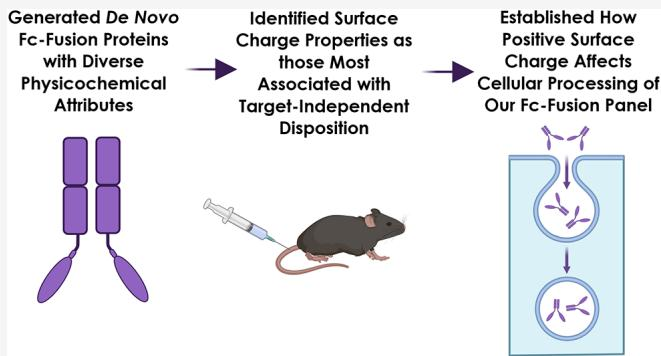

# 서론

바이오 의약품 산업은 IgG 기반 단일클론 항체(mAbs)의 성공을 발판 삼아, 혁신적인 치료 전략을 구현하기 위해 항체 기반 단백질 모달리티(modality)를 지속적으로 확장해 왔습니다.[^1-6] 이러한 흐름은 계산 과학 기반의 미니 단백질(miniproteins) 설계 기술과 결합하여 표적 결합의 새로운 지평을 열고 있습니다.[^7-9] 다만, 새로운 분자 형태를 설계할 때는 약리학적 효능뿐만 아니라 실제 의약품 생산을 위한 제조 가능성(developability) 사이의 적절한 균형이 반드시 고려되어야 합니다.[^10-20] 특히 신약 발견 및 최적화 단계에서는 약동학(PK) 매개변수로 설명되는 분포, 대사, 제거 등 유리한 체내 소실 특성을 확보하는 것이 핵심입니다. 이는 임상적 효능을 발휘하기 위해 체내에서 충분한 약물 노출량을 유지하는 데 필수적이기 때문입니다. 따라서 전임상 후보 물질의 설계를 개선하고 고도화하기 위해서는 치료용 단백질의 소실을 결정하는 요인들에 대한 깊은 기전적 이해가 선행되어야 합니다.[^21-22]

단일클론 항체가 효과적인 치료제로 자리 잡은 주요 이유 중 하나는 크기가 유사한 다른 단백질에 비해 표적 독립적 제거율이 낮다는 점입니다.[^23-24] 이러한 긴 반감기는 주로 Fc 영역이 신생아 Fc 수용체(FcRn, FCGRT) 및 $\beta 2$-마이크로글로불린(B2M)과 pH 의존적으로 상호작용하면서 나타납니다. 일반적으로 비특이적으로 내부화된 단백질은 리소좀에서 이화작용(lysosomal catabolism)을 거쳐 사라지게 됩니다.[^25-27] 하지만 세포 내로 섭취된 항체는 소낭 구획 내의 산성 pH 환경에서 FcRn과 높은 친화력으로 결합합니다.[^24-32] 이후 FcRn은 항체를 세포 표면으로 다시 운반하여 중성 pH 환경에서 방출(재활용)하거나 세포를 통과시키는 가로세포흐름(transcytose)을 유도합니다. 이처럼 비표적 제거를 억제할 수 있는 경로를 활용하기 위해 많은 치료용 단백질이나 펩타이드에 Fc 도메인을 통합하고 있습니다.[^22-24]

전임상 및 임상 단계의 항체들은 FcRn 결합력 차이만으로는 설명하기 어려운 매우 다양한 표적 독립적 제거율 $\mathrm{(CL_{ind})}$을 보입니다.[^22-33] 이에 따라 항체 간 소실 특성의 차이를 유발하는 물리화학적 요인을 규명하려는 연구가 활발히 진행되어 왔습니다.[^10-35] 그중에서도 '전하'는 약물의 제거 및 분포 이상과 밀접하게 연관된 핵심 속성으로 꼽힙니다. 대체로 음전하나 양전하가 과도한 항체는 $\mathrm{CL}_{\mathrm{ind}}$가 더 빠르고 비표적 조직 축적이 광범위하게 나타나는 경향이 있습니다.[^12-16][^18-43] 특히 본 연구팀을 포함한 여러 연구자들은 단순히 알짜 전하(net charge)뿐만 아니라 분포 패턴과 크기를 포함한 '표면 전하 특성'이 비특이적 세포내섭취(NSE), FcRn 상호작용 및 일반적인 세포 비특이성을 변화시켜 항체의 $\mathrm{CL}_{\mathrm{ind}}$에 상당한 영향을 미칠 수 있음을 입증한 바 있습니다.[^38-47] 용매에 노출된 양전하와 음전하를 띤 세포막 사이의 상호작용 방식에 따라 항체마다 NSE 속도가 크게 달라질 수 있으며, 이는 표적이 없는 세포에서도 높은 수준의 내부화를 유발합니다.[^44] 또한 이러한 표면 전하의 불균형은 FcRn과의 pH 의존적 결합을 방해하여, 리소좀으로 향하는 분율을 높이고 재활용 효율을 떨어뜨림으로써 항체의 이화작용을 가속화합니다.[^45-46]

이러한 선행 연구들은 물리화학적 특성이 치료용 항체의 성공 여부에 얼마나 큰 영향을 미치는지 잘 보여줍니다. 하지만 여전히 일반적인 경향성에서 벗어나는 사례가 빈번하게 발생합니다. 예를 들어 전하 기술자만으로는 높은 $\mathrm{CL}_{\mathrm{ind}}$나 조직 축적 현상을 완벽히 설명하지 못하는 경우가 많으며, 상관관계가 거의 없는 것으로 보고된 연구도 존재합니다.[^35-49] 즉, 물리화학적 속성과 제거·분포 사이의 관계를 규정하는 정확한 생리학적·세포적 기전은 아직 완전히 정의되지 않았습니다. 따라서 어떤 속성이 소실 위험을 높이는지 식별하고 그 기전적 근거를 이해하는 것은 Fc 기반 치료제의 제조 가능성을 높이는 데 매우 중요합니다. 아울러 이러한 PK 중심의 평가를 항체 외의 모달리티, 특히 아미노산 조성을 정밀하게 제어할 수 있는 데 노보 스캐폴드 영역으로 확장할 필요가 있습니다.[^7-9] 서열 재설계와 Fc 도메인 융합이 스캐폴드의 체내 거동에 미치는 영향을 규명한다면, 최적의 PK 특성을 설계하는 데 매우 유익한 정보를 얻을 수 있을 것입니다.

본 연구에서는 내인성 항원 결합이 배제된 상태에서 다양한 크기, 형태, 물리화학적 특성을 지닌 설계 단백질 패널의 PK 속성을 체계적으로 조사하였습니다. 이를 통해 소실 위험을 결정하는 주요 표적 독립적 요인들을 더 깊이 이해하고자 하였습니다. 연구팀은 서로 다른 크기와 토폴로지(topology)를 가진 5종의 데 노보 단백질을 선정하고, 고유의 폴딩 구조를 유지하면서도 표면 특성이 각기 다른 변이체들을 설계하였습니다. 제작된 Fc 융합 단백질의 PK 연구 결과, 표면 전하가 체내 소실의 결정적 요인임을 확인하였으며, 광범위한 인 비트로 실험을 통해 이러한 인 비보 관찰 결과를 뒷받침하는 세포 내 기본 기전을 확립하였습니다.

# 재료 및 방법

## 세포 배양

NSE 분석용 CHO-K1 세포는 Amgen 내부에서 확보하였으며, $10\%$ 열 불활성화 태아 혈청(#16140071, Thermo)을 포함한 Ham's F-12K 배지(no. 21127022, Thermo Fisher, Waltham, MA)에서 배양하였습니다. 최적의 계대 배양 조건은 2~3일마다 $\mathrm{cm}^2$ 당 $1.5 \sim 2.0 \times 10^{4}$ cells로 유지하였습니다. 인간 제대 정맥 내피 세포(HUVECs)는 GFP 발현 라인(#cAP-0001GFP, Angioprotomie, Boston, MA)과 야생형 라인(#CC-2519, Lonza, Walkersville, MD)을 사용하였습니다. 미세 유체 칩 시딩 전까지 VascuLife VEGF 배지(# LL-0003, Lifeline Cell Technology, Frederick, MD)에서 $80\%$ 합생(confluency) 상태로 관리하였습니다. 인간 폐 섬유아세포(#CC-2512, Lonza)는 FibroLife 배지(#LL-0011, Lifeline Cell Technology)에서 배양하여 $80\%$ 합생 상태에 도달할 때까지 관리하였습니다. hFcRn-GFP/h $\beta$ m MDCK-II 및 모세포 MDCK-II 세포는 선행 연구에 기술된 방식대로 조달, 제작 및 배양하였습니다. 모든 부착 세포는 $37^{\circ}\mathrm{C}$, $5\%$ $\mathrm{CO}_{2}$ 환경에서 배양되었습니다. 암젠 내부의 부유 배양용 CHO-K1 세포주는 $50\%$ EX-CELL 302 무혈청 배지(#14324C, Sigma-Aldrich, St. Louis, MO), $50\%$ 자체 제조 CHO-K1 성장 배지에 $2\mathrm{mM}$ L-글루타민(#25030081, Gibco/Thermo Fisher)을 첨가하여 사용하였으며, $120\mathrm{rpm}$의 진탕기에서 주 2회 분할 배양하였습니다.

## 단백질 설계

설계된 모든 단백질의 백본(backbone) 설계에는 "Blueprint Builder" 방식이 적용되었습니다. 먼저 ABEGO 표기법을 통해 모든 아미노산의 phi/psi 빈(bins)을 지정한 뒤, 서열 정보 없이 Rosetta 폴딩 시뮬레이션을 수행하여 단백질 사슬의 phi/psi 빈을 제약하였습니다. PDB의 9개 아미노산 조각을 활용하여 목표한 빈과 일치하는 구조를 생성하고, 단순화된 에너지 함수를 바탕으로 몬테카를로(Monte Carlo) 방식으로 삽입하였습니다. 최종 단계에서는 3개 아미노산 조각으로 교체하여 백본 구조를 정밀하게 조정하였습니다.

FastDesign은 FastRelax 프로토콜 기반의 Rosetta 설계 프로세스입니다. 아미노산 서열을 반복적으로 설계하면서 원자 위치를 최소화하고, 반발력 가중치를 4단계(2%, 25%, 55%, 100%)에 걸쳐 점진적으로 증가시키며 Rosetta 에너지 함수를 최적화하였습니다(통상 3회 반복).

이후 포워드 폴딩(Forward folding)을 통해 설계된 서열의 폴딩 모델 환경을 샘플링하였습니다. 가장 낮은 에너지 구조가 설계된 구조 근처에 밀집되어 있고, 다른 영역에서 저에너지 대안이 발견되지 않을 때 성공적인 설계로 판단하였습니다.

스캐폴드별 상세 설계 방식은 다음과 같습니다. 5UOI의 경우 Blueprint Builder로 제작된 헬릭스 청크를 활용하고 FastDesign과 포워드 폴딩을 통해 서열을 최종 선정하였습니다.[^50] 2KL8 역시 Blueprint Builder로 백본을 생성한 후 FastDesign과 포워드 폴딩으로 서열을 확정하였습니다.[^51] TIM은 특정 시트(sheet) 및 헬릭스 길이를 지정하여 백본을 생성한 뒤, 루프에 수동 돌연변이를 도입하여 정제하였습니다.[^52] LCB1은 5UOI와 유사한 방식으로 백본을 만든 뒤 Patchdock/Rifdock 파이프라인으로 인터페이스를 정밀 설계하고 FastDesign으로 최적화하였습니다.[^53] TH1 단백질은 헬릭스 위치를 파라미터 방식으로 생성하고 PDB 조각 조회를 통해 루프를 연결한 뒤 FastDesign으로 서열을 확정하였습니다.[^54]

## 플라스미드

모든 데 노보 설계 단백질은 이펙터 기능이 제거된(effectorless) 인간 IgG1 Fc의 C-말단에 융합되었습니다.[^55] DNA 조각은 IDT(Coralville, IA) 또는 Twist Bioscience(South San Francisco, CA)에서 합성하였으며, piggyBac(PB) 트랜스포세이즈 시스템 호환 벡터에 클로닝하여 서열을 확인하였습니다.[^56] 모든 제작물은 형질전환(transfection) 전에 서열이 확인되었습니다.

## 포유류 발현

부유 배양용 CHO-K1 세포주는 EX-CELL 302 무혈청 배지(Sigma)와 $2\mathrm{mM}$ L-글루타민(Gibco)을 첨가한 맞춤형 CHO-K1 성장 배지에서 배양하였습니다. 모든 Fc 융합 단백질은 앞서 기술된 트랜스포즈 기반 기술을 통해 CHO-K1 세포에서 안정적으로 발현되었습니다.[^56] 조건 배지(CM) 내 Fc 융합 단백질의 역가는 단백질 A 바이오센서(catalog no. 18-0004, ForteBio)를 이용한 옥텟(octet) 분석이나 SDS-PAGE로 추정하였습니다.

## 재조합 단백질 정제

단백질은 TBS(20 mM Tris, 150 mM NaCl, pH 7.5)로 미리 평형화된 mAb Select Sure 컬럼(catalog no. 11003495, Cytiva)에서 캡처되었습니다. TBS로 세척한 후, 결합된 단백질을 $0.5\%$ 아세트산, 150 mM NaCl, pH 3.5로 용리하였으며, HBS(30 mM HEPES, 150 mM NaCl, pH 7.6) 완충액을 사용하는 HiLoad Superdex 200 pg SEC 컬럼(cat. no. 28989336, Cytiva)을 통해 추가 정제하였습니다. 정제된 단백질은 $0.22\mu \mathrm{m}$ Posidyne 시린지 필터(cat. no. 4908, Pall Corporation)로 여과하여 $-80^{\circ}\mathrm{C}$ 에 보관되었습니다. 일부 단백질이 SEC에서 단일 피크를 보이지 않는 경우 2xPBS 완충액을 제형 완충액으로 사용하였습니다. 단백질 농도는 Nanodrop 분광 광도계(Thermo Fisher Scientific)로 측정하였습니다.

## 분석용 SEC

분석용 SEC는 HPLC(Agilent 1200 series)와 Sepax Zenix-C SEC-300 $3\mu \mathrm{m}$ $300\times 4.6$ mm LC 컬럼(cat no. 233300-4630, Sepax)을 사용하여 수행되었습니다. 분석 조건은 $100~\mathrm{mM}$ 인산나트륨 및 $250~\mathrm{mMNaCl}$, pH 6.8에서 유속 $0.45~\mathrm{mL / min}$, 실행 시간 $12\mathrm{min}$ 이었습니다.

## LC-MS를 이용한 온전한 질량 분석

비환원 및 환원 LC-MS 분석용 샘플은 $5\mu \mathrm{g}$의 단백질을 동일 부피의 $0.1\%$ 포름산과 혼합하여 준비했습니다. 환원 LC-MS 분석의 경우, $5\mu \mathrm{g}$의 단백질을 $8\mathrm{M}$ 구아니딘 염산염과 혼합한 뒤 $16.7~\mathrm{mM}$ TCEP(cat no. 77720, Thermo Fisher Scientific)를 첨가하고 $60^{\circ}\mathrm{C}$에서 $30\mathrm{min}$ 동안 반응시켰습니다. 샘플은 Agilent 6230 TOF 질량 분석기 및 Agilent 1200 HPLC 시스템을 통해 온전한 질량(intact mass)을 확인하였습니다. 분리는 C4 역상 컬럼(Mac-mod)을 사용하여 5-95% B 구배로 수행되었습니다.

## 엔도톡신 측정

모든 정제 단백질은 Endosafe LAL 카트리지와 nexgen-MCS(Charles River)를 사용하여 엔도톡신 수치가 $0.5 \mathrm{EU/mg}$ 미만임을 확인하였습니다.

## 미세 모세관 전기영동(MCE)

단백질 순도는 Caliper LabChip GXII 시스템(PerkinElmer)을 사용하여 특성화되었습니다. Protein express 시약 및 LabChip HT 칩을 사용하여 제조사 프로토콜에 따라 분석을 진행하였습니다. Chromeleon 소프트웨어(Thermo Fisher Scientific)를 사용하여 피크 면적을 적분하였습니다.

## 단백질 특성의 인 실리코 계산

모든 분자는 N-말단 Fc, Fc-단백질 링커, C-말단 His$_6$-태그를 포함한 동일한 모듈을 가집니다. 데 노보 단백질 부분에 대해서만 속성 계산을 수행하였습니다. AlphaFold2를 이용해 3차원 구조를 예측한 뒤, MOE(Molecular Operating Environment)를 활용하여 나머지 계산을 수행하였습니다. LowModeMD를 통해 생리학적 pH 범위(6.4-8.4)에서 100개의 컨포머(conformer) 앙상블을 생성하고, 이에 대한 속성 평균값을 산출하였습니다.

## 혈청 농도 약동학 연구

모든 동물 실험은 AAALAC 가이드라인을 준수하며 Amgen 실험 동물 운영 위원회의 승인 하에 진행되었습니다. 암컷 야생형 C57BL/6J 마우스에 $2\mathrm{mg/kg}$의 용량을 꼬리 정맥으로 정맥 주사하였습니다. 빈번한 채혈이 필요하여 단백질당 최소 2개 그룹의 마우스로 나누어 채혈 시점을 교차 배치하였습니다. 분리된 혈청은 $-70^{\circ}\mathrm{C}$ 에 보관하였으며, WatsonLIMS 소프트웨어를 통해 PK 매개변수를 산출하였습니다.

## 생체 분포 연구

생체 분포 연구를 위해 방혈 직후 주요 조직을 적출하여 $0.9\%$ 식염수로 세척한 뒤 급속 냉각하였습니다. 샘플링 시점은 내부 데이터와 선행 연구를 바탕으로 선정되었습니다.[^43] 대식세포 고갈 실험에서는 단백질 투여 2일 전에 클로드로네이트(clodronate) 리포좀을 $10\mu \mathrm{L}/ \mathrm{g}$ 용량으로 투여하였습니다.[^58]

## 마우스 혈청 및 조직 내 Fc 융합 단백질 농도 정량

혈청 및 조직 내 농도는 MSD(Meso Scale Diagnostics) 장비를 이용한 전기 화학 발광 면역 분석법으로 정량화하였습니다. 비오틴화된 항-HIS 태그 항체를 캡처용으로, 루테닐화된 항-인간 Fc 항체를 검출용으로 사용하였습니다. 조직 샘플은 Precellys 균질기에서 용해 완충액과 함께 균질화하여 분석에 사용하였습니다.

## CHO-K1 NSE 측정

CHO-K1 세포를 이용한 NSE 측정은 pH 5.8 또는 7.4 조건에서 유세포 분석법을 활용하여 선행 연구와 동일한 방식으로 수행하였습니다.[^44-45]

## Fc 융합 단백질의 인간 FcRn 재활용 연구

인간 FcRn 재활용 실험은 hFcRn-GFP/h $\beta$ 2m MDCK II 세포를 사용하여 로드(load, 2시간) 및 재활용(recycle, 4시간) 단계별로 단백질 양을 MSD 분석으로 측정하였습니다. 섭취 단계는 $37^{\circ}\mathrm{C}$에서 진행되었으며, 세포 용해물과 상층액을 각각 수집하여 분석하였습니다.[^45]

## MesoScale Discovery 면역 분석법에 의한 세포 hFcRn 재활용 분석 샘플 분석

MSD 분석은 앞서 기술된 방식에서 항체 농도(1 $\mu\mathrm{g}/ \mathrm{mL}$)와 완충액 조건을 최적화하여 수행되었습니다. 강력한 검출 신호를 확보하기 위해 MSD 리드 완충액 농도를 $2\times$에서 $1\times$로 낮추었습니다.

## 인간 FREM 점수

FREM(FcRn 재활용 효율 지표) 및 NUC(비특이적 섭취 계수) 점수를 산출하였습니다.[^45-46][^59] 모든 데이터는 SEFL2 수정 우스테키누맙으로 정규화되었습니다.

## 단백질의 플루오레세인 이소티오시아네이트(FITC) 및 Dylight(DL) 650 표지

TH1 전하 하위 시리즈를 NHS-FITC 또는 DyLight 650-NHS 에스테르로 표지하였습니다. 표지된 단백질은 Zeba 스핀 컬럼을 통해 정제되었으며, 최종 농도와 표지 효율은 Nanodrop으로 측정하였습니다.

## 이미지화된 모세관 등전점 전기영동(icIEF) 분석

CE-Infinite 시스템을 사용하여 등전점 변화를 정량화하였습니다. pI 마커를 사용하여 정확한 값을 측정하였으며, 데이터는 Agilent ChemStation 소프트웨어로 분석되었습니다.

## 미세 유체 장치 내 미세 혈관 네트워크(MVN) 형성

3D 미세 혈관 네트워크(MVN)는 HUVECs와 섬유아세포를 피브리노겐/트롬빈 젤 내에 공동 배양하여 형성하였습니다. 샘플은 7일 동안 매일 배지를 교체하며 유지되었습니다.

## MVN 내 정점-기저부 단백질 투과성 이미징

공초점 현미경을 이용해 DL650 표지 단백질($0.6\mu \mathrm{M}$)과 TRITC-덱스트란($70\mathrm{kDa}, 0.6\mu \mathrm{M}$)의 투과성을 시각화하였습니다. $37^{\circ}\mathrm{C}$ 환경에서 0분과 $12\mathrm{~min}$에 이미지를 획득하여 형광 강도 변화를 정량화하였습니다.[^61]

## MVN 내 단백질 투과성 이미지 분석

맞춤형 Python 워크플로와 Ilastik 분할 도구를 사용하여 투과 계수($\mathrm {c m / s e c}$)를 계산하였습니다.[^62-64] Random Forest 분류기를 통해 매트릭스와 혈관 영역을 분리하고, 부피 및 표면적 데이터를 추출하였습니다.

$$
\text {투과성} (\mathrm {c m / s e c}) = \frac {1}{\Delta t} \frac {V _ {\mathrm { M }}}{S A _ {\mathrm { V }}} \frac {\Delta I _ {\mathrm { M }}}{\Delta I}
$$

여기서 $\Delta t$는 시작 및 최종 이미지 획득 사이의 시간 차이이고, $V_{\mathrm{M}}$은 매트릭스 부피, $SA_{\mathrm{V}}$는 혈관의 표면적, $\Delta I_{\mathrm{M}}$은 세포외 매트릭스 내 강도의 증가를 나타내며, $\Delta I = I_{V(t = 0)} - I_{\mathrm{M}(t = 0)}$은 실험 시작 시 혈관과 매트릭스 사이의 평균 강도 차이를 보고합니다.

## 미세 유체 장치 내 인 비트로 간질 상호작용 측정

FRAP법을 사용하여 단백질의 확산 계수 및 비이동 분율을 측정했습니다.[^60][^65] $0.6\mu \mathrm{M}$ FITC 표지 단백질을 장치 측면 채널에 첨가하고 $24\mathrm{h}$ 동안 배양했습니다. 다음 날, SP8 공초점 현미경에서 FRAP 분석을 수행하여 단백질의 확산 속도를 산출했습니다. 비이동 분율은 발표된 방법에 따라 계산되었습니다.[^66-67]

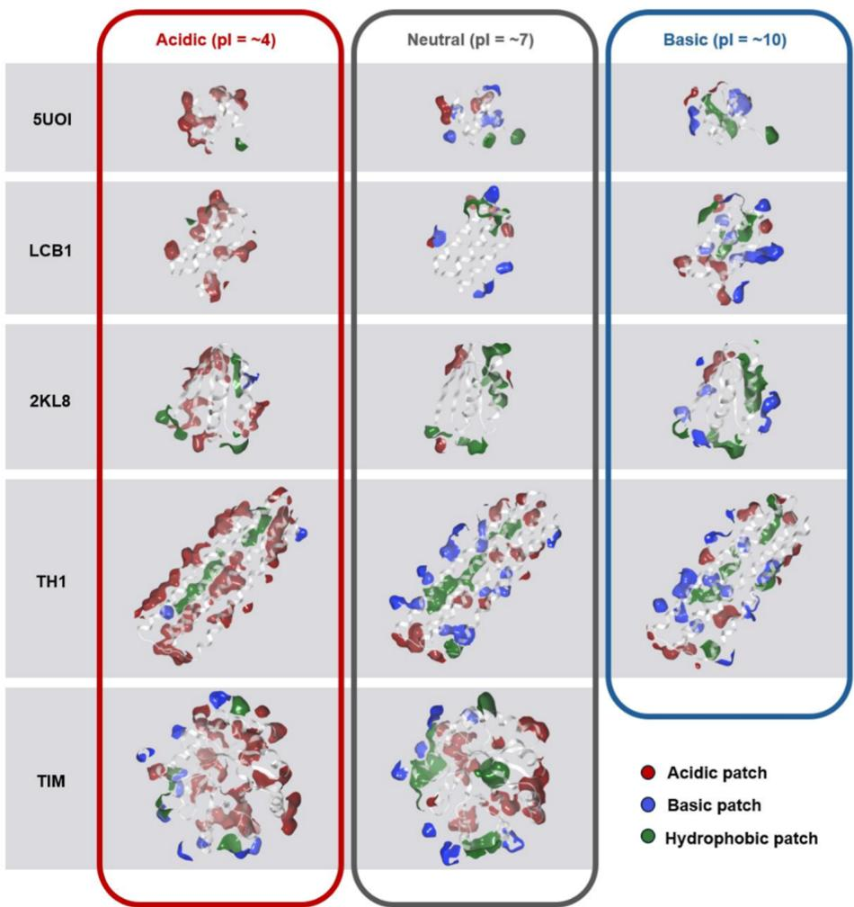  

그림 1. 목표 물리화학적 특성을 가진 설계된 데 노보 Fc 융합 단백질 패널. 등전점(pI), 표면 패치 및 크기를 포함하여 광범위한 생물물리학적 특성을 포괄하도록 35개의 데 노보 단백질 패널이 설계되었습니다. (A) 대표적인 Fc 융합 단백질의 AlphaFold2 구조(왼쪽). 융합 패널에는 서로 다른 데 노보 스캐폴드가 포함되었습니다(오른쪽). 생물물리학적 계산은 Fc와 링커 없이 데 노보 단백질에 대해서만 수행되었습니다. 알파 헬릭스와 베타 시트는 각각 녹색과 파란색으로 표시됩니다. (B) 각 데 노보 스캐폴드에 대한 서로 다른 전하 변이체의 대표 구조. 표면 패치는 범례에 표시된 색상으로 표시됩니다. 표면 패치로 인정되려면 $40\AA^2$ 이상의 연속된 전하 표면적 또는 $50\AA^2$ 이상의 연속된 소수성 표면적이 필요했습니다. 더 나은 시각화를 위해 앞면의 패치는 숨겨져 있습니다.
 
그림 2. 설계된 데 노보 단백질 패널. 35개 데 노보 단백질 모두 이름과 pI 값이 표시되어 있습니다. 양성(파란색), 음성(빨간색) 및 소수성(녹색) 패치가 표시됩니다. 각 변이체는 왼쪽에서 오른쪽으로 pI가 증가하는 순서(낮은 pI; 산성, 높은 pI; 염기성)로 배열되며 알파벳순으로 고유 식별 문자가 부여됩니다. 결과적으로 각 스캐폴드 내에서 가장 산성인 변이체는 A로 라벨링되었으며 가장 염기성인 pI 값까지 이어집니다(예: 2KL8-A는 pI가 가장 산성인 2KL8 스캐폴드의 단백질 변이체이고 2KL8-E는 가장 염기성임). LCB1 및 TH1 전하 시리즈의 경우, 각 시리즈에서 선택된 3개의 대표 변이체에 서로에 대한 상대적 pI 값에 해당하는 명칭을 부여했습니다(예: 산성, 중성 근처, 염기성. 여기서 산성-TH1은 선택된 3개 TH1 단백질 중 pI가 가장 낮음).

표 1. 모든 Fc 융합 단백질의 약동학적 특성 및 제거율과 유의미하게 상관관계가 있는 3가지 기술자 값   

<table><tr><td>융합 단백질</td><td>MW (kDa)</td><td>AUC0-last (nM × hr)</td><td>제거율 (mL/h/kg)</td><td>pI_seq</td><td>알짜 전하</td><td>patch_pos_%</td></tr><tr><td>2KL8-A</td><td>7.20 × 10^1</td><td>2.59 × 10^3</td><td>1.08 × 10^1</td><td>3.64 × 10^0</td><td>-1.59 × 10^1</td><td>1.46 × 10^0</td></tr><tr><td>2KL8-B</td><td>7.20 × 10^1</td><td>4.69 × 10^3</td><td>5.92 × 10^0</td><td>3.93 × 10^0</td><td>-1.13 × 10^1</td><td>3.29 × 10^0</td></tr><tr><td>2KL8-C</td><td>7.24 × 10^1</td><td>4.24 × 10^3</td><td>6.51 × 10^0</td><td>4.70 × 10^0</td><td>-2.98 × 10^0</td><td>1.07 × 10^1</td></tr><tr><td>2KL8-D</td><td>7.20 × 10^1</td><td>4.36 × 10^3</td><td>6.37 × 10^0</td><td>7.18 × 10^0</td><td>-2.06 × 10^-1</td><td>7.77 × 10^0</td></tr><tr><td>2KL8-E</td><td>7.22 × 10^1</td><td>1.28 × 10^3</td><td>2.17 × 10^1</td><td>1.01 × 10^1</td><td>3.54 × 10^0</td><td>1.27 × 10^1</td></tr><tr><td>SUOI-A</td><td>6.34 × 10^1</td><td>1.54 × 10^4</td><td>2.05 × 10^0</td><td>3.84 × 10^0</td><td>-1.10 × 10^1</td><td>1.84 × 10^0</td></tr><tr><td>SUOI-B</td><td>6.35 × 10^1</td><td>2.06 × 10^4</td><td>1.53 × 10^0</td><td>4.22 × 10^0</td><td>-6.48 × 10^0</td><td>3.83 × 10^0</td></tr><tr><td>SUOI-C</td><td>6.33 × 10^1</td><td>1.08 × 10^4</td><td>2.92 × 10^0</td><td>4.31 × 10^0</td><td>-4.06 × 10^0</td><td>5.26 × 10^0</td></tr><tr><td>SUOI-D</td><td>6.34 × 10^1</td><td>3.46 × 10^3</td><td>9.13 × 10^0</td><td>6.38 × 10^0</td><td>-2.19 × 10^-2</td><td>8.57 × 10^0</td></tr><tr><td>SUOI-E</td><td>6.35 × 10^1</td><td>9.18 × 10^3</td><td>3.43 × 10^0</td><td>6.44 × 10^0</td><td>-2.71 × 10^-2</td><td>1.09 × 10^1</td></tr><tr><td>SUOI-F</td><td>6.35 × 10^1</td><td>1.84 × 10^3</td><td>1.71 × 10^1</td><td>9.89 × 10^0</td><td>1.04 × 10^0</td><td>1.42 × 10^1</td></tr><tr><td>SUOI-G</td><td>6.35 × 10^1</td><td>4.25 × 10^3</td><td>7.41 × 10^0</td><td>9.89 × 10^0</td><td>1.03 × 10^0</td><td>1.42 × 10^1</td></tr><tr><td>SUOI-H</td><td>6.34 × 10^1</td><td>2.03 × 10^3</td><td>1.55 × 10^1</td><td>1.05 × 10^1</td><td>2.10 × 10^1</td><td>1.43 × 10^1</td></tr></table>

# 결과

## 다양한 물리화학적 속성을 가진 Fc 융합 단백질 패널의 설계 및 생산

우리는 Fc 융합체 소실에 미치는 생물물리학적 특성의 영향을 체계적으로 연구하기 위해 데 노보 생성 단백질을 모델로 선정하였습니다. 인 실리코에서 설계된 이러한 이상적인 스캐폴드는 크기와 토폴로지가 다르며, 이론적으로 구조적 안정성을 유지하면서 표면 아미노산 조성을 극적으로 변화시킬 수 있습니다. 총 5종의 독창적인 스캐폴드가 선택되었습니다: 3개의 $\alpha$-헬릭스를 가진 $4.8\mathrm{kDa}$ 최소 단백질(PDB ID: 5UOI; [^50]), SARS-CoV-2 스파이크 단백질에 결합하는 LCB1로 명명된 $6.7\mathrm{kDa}$ 미니 바인더(PDB ID: 7JZL 및 7JZU; [^53]), $9\mathrm{kDa}$ 페레독신 유사 폴드 단백질(PDB ID: 2KL8; [^51]), $18\mathrm{kDa}$ 4-헬릭스 번들 단백질 TH1, 그리고 $20\mathrm{kDa}$ TIM 배럴(PDB ID: 5BVL, 6WVS; [^52][^68-69]). 각 스캐폴드에 대해 높은, 중성, 낮은 pI를 가지며 표면의 양성, 음성 또는 소수성 패치의 크기와 분포가 서로 다른 변이체들이 설계되었습니다. 이를 위해 MPNN을 사용하여 허용 가능한 아미노산 돌연변이를 찾고, 목표하는 표면 분포를 달성하는 데 필요한 최소한의 점 돌연변이를 수동으로 선택한 뒤, 마지막으로 AlphaFold2를 사용하여 돌연변이된 단백질이 여전히 동일한 형태로 접히는지 확인하였습니다.[^70-71]

이를 통해 크기가 5 ~ $20\mathrm{kDa}$이며, pI가 약 4, 7 또는 9이고 표면 전하 및 소수성 수준이 다른 단백질 패널이 성공적으로 생성되었습니다(그림 1 및 2, 표 1). 이러한 단백질들은 인간 IgG1 SEFL2 Fc의 C-말단에 융합되어 포유류 세포에서 발현 및 분비되었으며 정제되었습니다.[^55][^72] pI가 9보다 큰 Fc 융합 단백질은 일반적으로 생산하기 더 어려웠으며, 종종 고양전하 함량으로 인해 단백질 분해 절단(proteolytic cleavage)이 발생하기 쉬웠습니다(데이터 미표시). 절단된 제품이 $30\%$를 초과하는 로트는 폐기되었습니다. 최종 패널은 인 비보 PK 분석을 위한 35개의 고유한 Fc 융합 단백질로 구성되었습니다(표 S1).

## 인 실리코 전하 기술자는 야생형 마우스에서의 제거율과 가장 강력하게 상관관계를 나타낸다

그림 3. 전하 기술자는 마우스 제거율과 가장 강력하게 상관관계를 나타낸다.

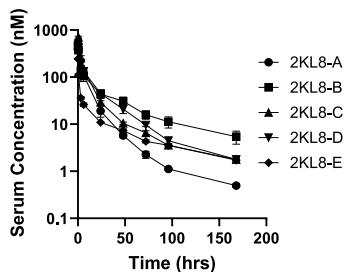  

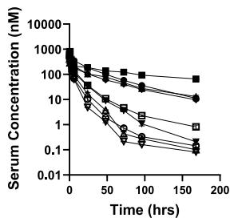

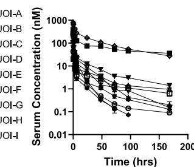

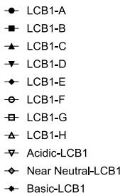

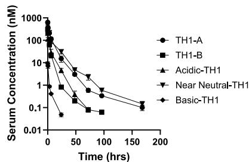

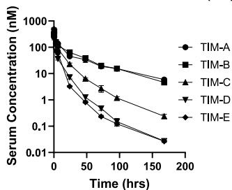

(A) 스캐폴드별로 그룹화된 C57BL/6J 마우스에 단일 정맥 볼루스 용량$(2\mathrm{mg / kg})$을 투여한 후 각 Fc 융합 단백질의 혈청 농도-시간 프로필.

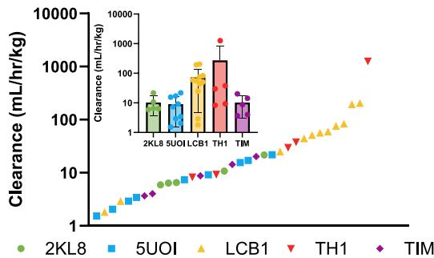  

(B) 비구획 분석을 사용하여 제거율(CL) 추정치를 얻었으며, $1.53\times 10^{0}$ 에서 $1.27\times 10^{3}\mathrm{mL/h/kg}$까지 넓은 범위의 값이 관찰되었습니다.

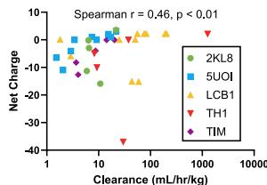  

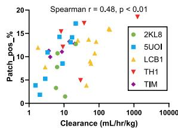

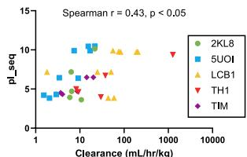

(C) 설계된 각 Fc 융합 단백질에 대해 데 노보 부분의 아미노산 서열만을 사용하여 물리화학적 기술자를 계산했습니다. CL과 가장 강력하게 연관된 서열 기반 기술자를 식별하기 위해 스피어만(Spearman) 상관관계 매트릭스를 수행했습니다. 평가된 53개 파라미터 중 서열 기반 pI(pI_seq), 알짜 전하 및 양성 단백질 패치의 총 표면적 백분율(patch_pos %)이 가장 높은 스피어만 상관관계를 나타냈습니다.

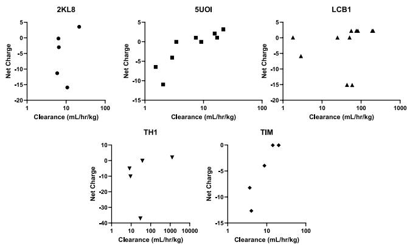

(D) 개별 Fc 융합 스캐폴드 조사 결과, 양의 알짜 전하가 증가함에 따라 CL이 감소하다가 다시 증가하는 U자형 관계가 입증되었습니다.

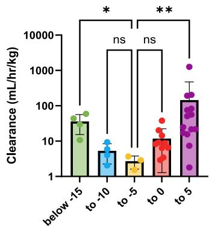  

(E) 모든 단백질 CL 값을 알짜 전하에 따라 빈으로 나누어 동시에 그래프로 나타냈습니다. 알짜 음전하 또는 양전하의 극단이 중간 그룹에 비해 CL이 유의하게 높은 명확한 U자형 관계가 관찰되었습니다. Kruskal-Wallis 테스트, $^*p<0.05$, $^{**}p<0.01$.

모든 Fc 융합 단백질은 야생형 C57BL/6J 마우스에 $2\mathrm{mg / kg}$ 정맥 볼루스 용량으로 개별 투여되었습니다. 야생형 마우스에는 알려진 결합 파트너가 존재하지 않을 것으로 예상되었으므로, 각 단백질의 비구획 분석을 통해 얻은 총 제거율(CL)은 표적 독립적 매개 과정에 의해 주도되는 $\mathrm{CL}_{\mathrm{ind}}$ 또는 CL로 해석되었습니다. 혈청 농도-시간 프로필에서 상당한 차이가 있었으며, $1.53 \times 10^{0}$ 에서 $1.27 \times 10^{3} \mathrm{~mL / h / kg}$에 이르는 넓은 CL 범위가 관찰되었습니다(그림 3A,B 및 표 1). 분자량과 CL 또는 곡선 아래 면적(AUC)으로 결정된 총 혈청 노출 사이에는 아무런 관계가 확인되지 않았습니다(그림 S1A).

마우스 CL과 가장 연관성이 높은 물리화학적 속성을 식별하기 위해 스피어만 상관관계 매트릭스를 시작점으로 수행했습니다(그림 3C). 이러한 기술자들은 Alpha-Fold 예측 입력 구조에 대해 LowModeMD를 실행하여 생성된 데 노보 모듈의 형태 앙상블을 사용하여 MOE에서 계산되었습니다. 앙상블 계산은 설계된 단백질 부분(예: $\sim 64\mathrm{kDa}$의 이가 Fc 융합체가 아닌 $7\mathrm{kDa}$ LCB1)만을 사용하여 얻었습니다.

아미노산 서열로부터 계산된 등전점(pI_seq, 스피어만 $r = 0.44$, $p < 0.01$), 아미노산 서열로부터 계산된 알짜 전하(스피어만 $r = 0.47$, $p < 0.01$), 그리고 양성 단백질 패치 표면적 백분율(patch_pos_%, 스피어만 $r = 0.47$, $p < 0.01$)이 CL과 가장 높은 스피어만 상관관계를 가진 인 실리코 기술자로 식별되었습니다(그림 3C, 표 S2-S4). 상위 3개 상관 파라미터와 CL의 개별 플롯을 조사한 결과, 파라미터 값이 증가함에 따라 CL이 감소하다가 다시 증가하는 스캐폴드 시리즈 내의 U자형 관계가 밝혀졌습니다(그림 3D, S1B,C). 이러한 경향은 알짜 전하에서 가장 뚜렷했으며, 모든 데 노보 스캐폴드 시리즈에서 고리 모양의 꼬리(hooked tail)가 관찰되었습니다. 이 효과는 5UOI 및 TIM 시리즈에서 약간 덜 두드러졌는데, 이는 아마도 강한 음전하(알짜 전하 -15 이하)를 가진 변이체가 부족했기 때문일 것입니다. 이는 모든 단백질에 대해 계산된 CL 값을 알짜 전하를 기준으로 5개 빈에 넣어 그래픽으로 묘사되었으며, 중간값에 비해 반대 극성의 극단에서 CL이 유의하게 상승하는 것이 관찰되었습니다(그림 3E).

그림 4. 상대적으로 과도한 음전하 또는 양전하를 가진 단백질은 조직 축적이 증가한다. (A) 알짜 전하와 (B) 제거율(CL) 사이의 U자형 관계를 나타낸 TH1 및 LCB1 모달리티의 총 6개 단백질(산성, 염기성 및 중성 근처 pI). (C) 중성 근처 pI 단백질에 비해 모든 전하 변이체의 노출 감소 및 CL 증가를 보여주는 혈청 농도 시간 프로필. 점당 $N = 3$ 마리의 별개 동물. (D) C57BL/6J 마우스에 정맥 볼루스 용량$(2\mathrm{mg / kg})$을 투여한 후 30분 후 간, 신장 및 비장 내 조직 농도를 조사하여 생체 분포 연구를 수행했습니다. 중성 근처 pI 비교군에 비해 알짜 전하 극단을 가진 모든 단백질에서 조직 정체가 유의하게 증가하는 것이 관찰되었습니다. 각 점은 개별 동물을 나타내며, Dunnett의 다중 비교를 포함한 이원 ANOVA; ns, 유의하지 않음, $^{*}p < 0.05$, $^{**}p < 0.01$, $^{****}p < 0.0001$.

(A)
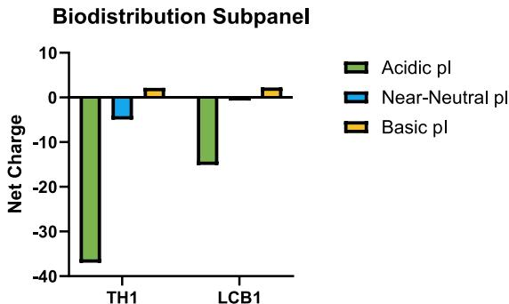  

(B)
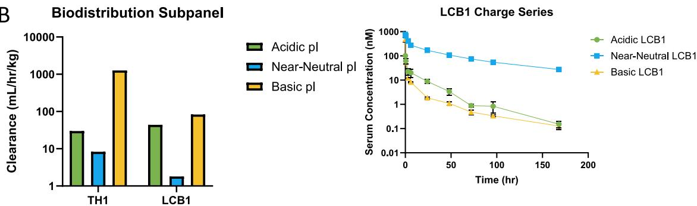  

(C)
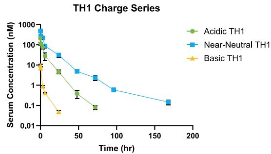

(D)
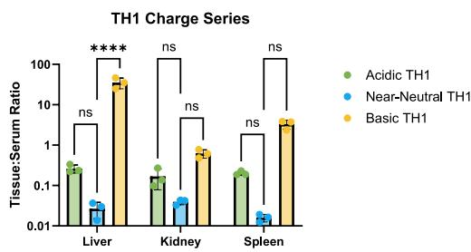  
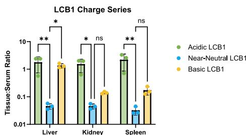  

## 상대적인 알짜 전하 극단은 CL 증가 및 조직 축적 상승과 연관되어 있다

우리는 TH1 및 LCB1 단백질의 하위 세트에서 마우스 생체 분포 평가를 수행하여 알짜 전하에 대한 관찰을 확장했습니다. 이러한 스캐폴드들은 넓은 범위의 CL을 가진 단백질들과 상대적 pI 값을 기반으로 명명된 여러 돌연변이체를 포함하고 있었기 때문입니다. 이에 따라 5개의 TH1 단백질에는 산성-TH1, 중성 근처-TH1, 염기성-TH1 및 두 개의 추가 중성 근처 변이체(TH1-A 및 TH1-B)가 포함되었습니다. 11개의 LCB1 단백질은 산성-LCB1, 중성 근처-LCB1, 염기성-LCB1 및 8개의 추가 변이체: 산성 2개(LCB1-A, LCB1-B), 중성 근처 2개(LCB1-C, LCB1-D), 염기성 4개(LCB1-F, LCB1-E, LCB1-G, LCB1-H)였습니다. LCB1-G는 일부 Asp, Glu, Arg, Lys 잔기를 Gln으로 교체하여 전하 잔기 수를 줄였으며, LCB1-H는 거의 모든 Asp, Glu, Arg, Lys 잔기를 Gln으로 교체하여 가장 적은 전하 잔기를 가졌습니다.

이로부터 중성 근처 pI 단백질 1개(near-neutral-TH1 및 near-neutral-LCB1), 더 음의 알짜 전하를 가진 산성 단백질 1개(acidic-TH1 및 acidic-LCB1), 더 양의 알짜 전하를 가진 염기성 단백질 1개(basic-TH1 및 basic-LCB1)를 선택했습니다(그림 4A-C, 표 1). 마우스 간, 신장 및 비장을 단백질당 $2\mathrm{mg/kg}$ 용량으로 정맥 볼루스 투여 후 30분에 수집했습니다. 이 조직들은 높은 혈류 속도와 항체 이화작용에 대한 기여도, 그리고 단백질 전하가 생체 분포에 미치는 영향을 입증한 선행 연구를 바탕으로 선택되었습니다.[^36][^38][^73-79] 그 결과, 빈(bin)에 관계없이 동일한 스캐폴드의 중성 근처 pI 단백질에 비해 과도한 알짜 전하를 가진 변이체에서 조직/혈청 비율이 증가하는 것을 관찰했습니다(그림 4D). 이는 모체 형태와 알짜 전하 차이가 큰 단백질이 더 빠른 CL과 더 높은 조직 축적을 나타낸다는 다른 연구자들의 연구 결과와 일치합니다.[^36-38][^41-42][^44][^78]

## Fc 융합체의 CL을 결정하는 세포 과정에서 전하의 역할

우리의 다음 목표는 전하에 민감한 단백질 소실을 주도하는 지배적인 기전을 확립하는 것이었으며, 초기에는 항체와 Fc 융합 단백질이 공유하는 혈청 PK, 즉 공통 $\mathrm{CL}_{\mathrm{ind}}$ 경로에 집중했습니다. 항체에 중요한 정전기적 제거 기전이 새로운 Fc 융합 단백질에도 적용되어, 높은 용매 노출 양전하가 NSE를 향상시키고 세포 내 비특이적 결합을 높이며 FcRn 재활용 효율을 감소시킬 것이라고 가설을 세웠습니다.[^45] 이는 pH 5.8 및 7.4 조건에서 CHO-K1 세포 내의 비특이적 단백질 내부화를 정량화하는 기 구축된 세포 기반 분석법을 통해 테스트되었습니다.[^44-45] 중성 근처 pH에서의 분석은 세포외 환경과 유사한 조건 하에서의 NSE를 직접 평가하는 것이며, 산성 pH 5.8 조건은 엔도좀 트래피킹 중의 산성화로 인해 비특이적 변화가 일어날 수 있고 FcRn 상호작용이 발생하는 엔도좀 환경을 모사하기 위함입니다.

전체 Fc 융합 단백질 시리즈에 걸쳐 넓은 범위의 NSE 값이 측정되었으며, 이는 테스트된 두 pH 값 모두에서 마우스 CL과 유세포 분석법에서 유의미한 상관관계를 나타냈습니다(pH 5.8에서 스피어만 $r = 0.55, p < 0.001$; pH 7.4에서 $0.54, p < 0.001$; 그림 S2A-C). 조사된 거의 모든 단백질에서 pH 7.4 대비 pH 5.8에서 NSE가 증가하는 것이 관찰되었으며(그림 S2A, B), 이는 산성 pH에서의 세포 비특이적 상호작용 증가를 시사합니다.[^45] NSE와 pH 의존적 관계에 대한 관찰을 강화하기 위해, 본 연구를 위해 pH 5.8에서 추가 측정한 8종을 포함하여 이전 보고서의 18종 항체에 대한 평가 결과를 포함시켰습니다.[^44-45] 모든 항체는 산성 pH에서 NSE 증가를 보였으며(그림 S2D), 54종 전체 단백질(항체 18종, Fc 융합체 35종)에 대해 플롯한 두 pH에서의 NSE 값은 강력한 상관관계를 나타냈습니다(그림 S2E). 이러한 관찰은 산성 pH에서의 높은 양전하가 치료용 단백질의 세포 비특이성을 향상시킬 수 있다는 우리의 이전 결론을 뒷받침하며, 초기 관찰을 확장하여 Fc-단백질 모달리티와 무관한 보다 일반적인 기전임을 시사합니다.[^45]

물리화학적 특성이 Fc 융합 단백질 $\mathrm{CL}_{\mathrm{ind}}$에 중요한 세포 과정에 어떻게 정보를 제공할 수 있는지 더 잘 이해하기 위해, pH 7.4에서의 CHO-K1 NSE 값과 알짜 전하, pI_seq 또는 patch_pos_% 사이의 관계를 그래픽으로 탐색했습니다. 함께 분석했을 때, 모든 지표는 주어진 기술자의 정체기(plateau)를 포함하는 광범위한 NSE 범위를 가진 S자형 관계를 보여주었습니다(그림 5C). 또한 NSE와 소수성 기술자 사이에는 아무런 연관성이 발견되지 않았습니다(그림 S3). 마찬가지로 NSE 측정값을 알짜 전하에 따라 빈으로 나누었을 때도 유사한 결과가 나타났습니다. 알짜 전하가 양의 방향으로 갈수록 일반적인 증가가 관찰되었으나, 전하가 유사한 단백질들 사이에서도 엄청난 변동이 확인되었습니다(그림 5D). 이러한 관찰과 일치하게, 항체의 서열 기반 알짜 전하를 전체 아미노산 서열을 사용한 Fc 융합체의 계산된 알짜 전하와 함께 포함시켰을 때도 pH 7.4에서의 NSE와 아무런 관계를 보이지 않았습니다(그림 S4A).[^44] 그러나 개별 Fc 단백질 스캐폴드를 조사했을 때는 NSE 증가가 일반적으로 양전하 증가와 연관되어 유의미한 상관관계가 입증되었습니다(그림 5E, S4B,C).

다음으로, 인간 $\beta 2\mathrm{m}$ 및 GFP 표지된 인간 FcRn이 안정적으로 공동 형질전환된 MDCK II 세포(hFcRn-GFP/h $\beta 2\mathrm{m}$-MDCK II 세포)를 사용하여 기 개발된 방법으로 Fc 융합 단백질의 전하 특성이 FcRn 재활용 효율에 미치는 영향을 직접 측정했습니다(그림 S5A). 이 분석은 모세포 MDCK II와 hFcRn-GFP/h $\beta 2\mathrm{m}$-MDCK II 세포를 모두 포함하며, pH 5.8에서 테스트 단백질과 함께 배양합니다. 분석 감도를 높여 NSE가 낮은 Fc 함유 단백질을 과도한 시료 소모 없이 평가하기 위해 산성 pH 조건을 선택했습니다. 분석의 "로드(load)" 단계 후 세포를 세척하고 용해하거나(섭취 분율), 무혈청 배지에서 배양하여 FcRn 매개 재활용을 유도합니다. 이후 배지를 수집하고(재활용 분율), 남은 세포를 용해하여(잔류 분율) 항-인간 Fc 면역 분석법으로 정량합니다. hFcRn 재활용 효율 지표(FREM)는 두 세포주에서의 결과를 통합하여 산출합니다(상세 내용은 방법 참조). 이전 보고서에서 참조 화합물 대비 $50\%$ 미만의 FREM 점수를 가진 항체는 $\mathrm{CL}_{\mathrm{ind}}$ 상승 위험이 높은 것으로, $25\%$ 미만은 신속한 $\mathrm{CL}_{\mathrm{ind}}$를 갖는 것으로 식별되었습니다.[^45]

본 연구에서는 넓은 범위의 물리화학적 속성과 소실 거동을 포괄하기 위해 TH1 및 LCB1 전하 생체 분포 하위 패널의 6종 Fc 융합 단백질을 분석했습니다. 낮은 세포 비특이성과 높은 FcRn 재활용 효율을 가진 항체 참조군으로 Fc-감마 이펙터 기능이 손상된 Fc 스캐폴드 기반의 우스테키누맙 연구용 아날로그(SEFL2 수정 우스테키누맙)를 포함시켰습니다.[^45] 양성 Fc 융합 변이체 두 가지 모두 매우 낮은 FREM 점수를 나타내어 양전하가 hFcRn 재활용 효율에 상당한 영향을 미침을 확인했습니다(그림 5F, SSB-I). 음성 TH1 및 LCB1 단백질은 Fc 융합체 중 가장 높은 FREM을 보였으며, 특히 산성 pI TH1 돌연변이체는 SEFL2 수정 우스테키누맙과 재활용 효율에서 정량적 차이가 없었습니다. 일반적으로 전하가 양의 방향으로 갈수록 비특이성이 높아져 FREM이 감소했으나, 중성 근처 LCB1 단백질은 예외였습니다. 중성 근처 LCB1 Fc 융합체는 염기성 pI 돌연변이체에 비해 세포 비특이성이 낮음에도 불구하고(그림 S2B 및 SSE), 재활용 출력은 더 양전하를 띤 대조군보다 약간 더 낮았습니다(그림 SSC,H). 이러한 종합적인 결과로부터 노출된 양전하로 인해 발생하는 높은 세포외 및 세포 내 비특이성이 NSE를 유도하고 FcRn 트래피킹 역학을 저해함으로써 Fc 융합 단백질의 제거율에 해로운 영향을 미친다고 결론지었습니다. 또한 NSE 수치나 FcRn 매개 재활용 능력 저하만으로는 매우 음의 알짜 전하를 가진 Fc 융합 단백질의 상승된 마우스 CL을 설명할 수 없었습니다.

이러한 결과로부터 몇 가지 결론을 도출할 수 있습니다. 첫째, 고도의 음전하 Fc 융합 단백질의 CL 증가를 주도하는 기전은 양전하 단백질과 구별됩니다. 이는 CL이 높은 분자를 식별하기 위해 비특이성 평가를 활용할 때 고도로 음이온성인 단백질에 대해서는 그 유용성이 제한됨을 의미합니다. 둘째, 계산된 전역 전하 기술자만으로는 세포 비특이적 행동에 대한 정밀한 정보를 제공할 수 없었습니다. 각 단백질 스캐폴드 시리즈 내에서 양전하가 낮을수록 NSE가 감소하는 보존된 경향이 발견되었지만, 그 감소 폭을 예측하기는 어려웠습니다. 이는 항체 알짜 전하와 Fc 융합체 알짜 전하 값을 함께 플롯했을 때 인 실리코-인 비트로 관계가 전혀 나타나지 않은 것에서 더욱 두드러집니다(그림 S4A). 이러한 관찰은 국소적 정전기-세포 상호작용을 더 잘 이해하기 위해 보다 정교한 전하 기술자가 필요함을 시사합니다.[^19] 또한 기술자-NSE 관계가 스캐폴드 내 연구에서도 항상 정비례하는 것은 아니었습니다. 이러한 결과는 전임상 항체 세트의 점 돌연변이 유도체들 사이에서는 알짜 전하와 NSE 간의 강한 경향성이 관찰되었으나, 더 넓은 항체 패널을 함께 평가했을 때는 그렇지 않았던 우리의 이전 연구 결과와 부합합니다.[^44] 이는 Fc 단백질의 인 비보 CL 거동을 파악하기 위해 전하 특성이 세포의 단백질 처리 방식에 미치는 영향을 실험적으로 측정하는 것이 필수적임을 강조합니다.

그림 5. 비특이적 세포내섭취 및 인간 FcRn 재활용은 증가된 양전하에 의해 바람직하지 않은 영향을 받는다. 비특이적 세포내섭취(NSE) 측정은 pH 5.8 (A) 및 pH 7.4 (B) 배양 조건에서 CHO-K1 세포를 사용하여 수행되었습니다. 형광 접합 항-인간 Fc 항체와 유세포 분석법을 사용한 면역 염색을 통해 단일 세포 관련 Fc 융합 단백질(즉, 표면 및 세포 내부)을 검출했습니다(단백질당 N=3-4). 집단 중앙값 형광 강도는 항체 결합 용량(ABCs)으로 변환되었으며, 이는 실험 간 비교를 용이하게 하기 위한 정량적 접근 방식입니다. 두 pH 값에서의 평균 CHO-K1 ABC와 마우스 제거율(CL) 사이에서 유의미한 스피어만 상관관계가 측정되었습니다(pH 5.8: 스피어만 $r = 0.55$, $p < 0.001$; pH 7.4: 스피어만 $r = 0.54$, $p < 0.001$). (C) 마우스 CL과 가장 강력하게 상관관계가 있는 세 가지 기술자인 서열 기반 pI, 알짜 전하 및 양성 단백질 패치의 총 표면적 백분율(patch_pos_%)과 CHO-K1 ABC 사이의 관계를 평가했습니다. 세 가지 플롯 모두 유의미한 스피어만 상관관계를 가진 S자형(sigmoidal)을 나타냈으며, 각 관계는 알짜 전하 -5.0 이상의 단백질에서 정체되었습니다. pI_seq, 알짜 전하 및 patch_pos_%의 스피어만 r은 각각 0.71 ($p < 0.0001$), 0.70 ($p < 0.0001$) 및 0.67 ($p < 0.0001$)이었습니다. (D) CL을 주도하는 기전을 더 잘 이해하기 위해 그림 2에 표시된 것과 동일한 알짜 전하 빈에 대해 CHO-K1 ABC를 플롯했습니다. 알짜 전하 -5.0 위에서만 상승된 NSE가 관찰되었으며, 이는 강한 양성 및 음성 단백질에 대해 두 개의 별개의 제거 경로가 있음을 시사합니다. (E) 개별 단백질 모달리티에 대해 알짜 전하와 CHO-K1 ABC를 비교한 결과, 합산 플롯보다 훨씬 더 명확한 관계가 입증되었습니다. (F) TH1 및 LCB1 전하 시리즈의 인간 FcRn 재활용 효율 지표를 얻기 위해 세포 FcRn 재활용 연구를 수행했습니다. 이펙터 기능이 없는 연구용 항체 우스테키누맙(SEFL2 수정 우스테키누맙)을 대조군으로 사용했습니다.

(A)
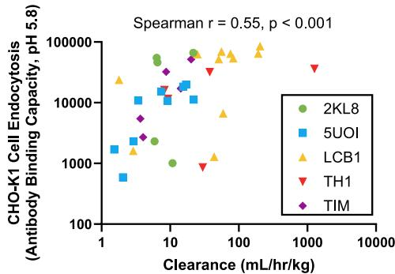  
 
(B)
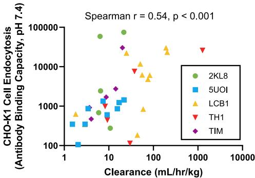

(C)
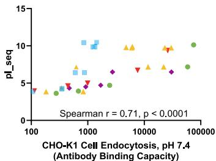  

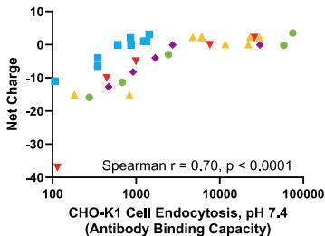

(D)
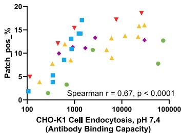
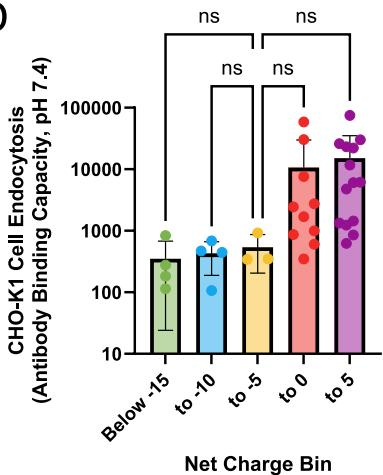  

(F)
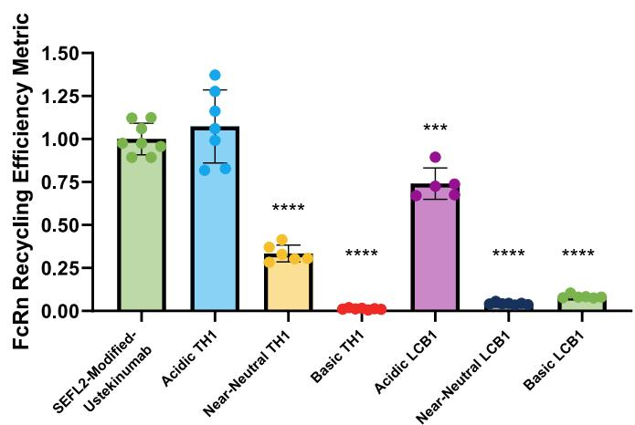  

(E)
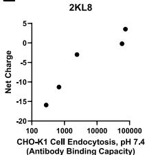  
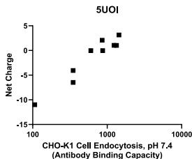
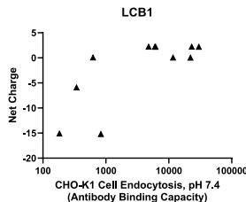
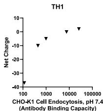
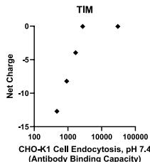  

## Fc 융합체의 비표적 조직 축적에서 전하의 역할

제작된 Fc 융합 단백질의 CL 결정 요인을 평가한 후, 전하 변이에 따른 조직 정체 증가를 주도하는 기전적 요인을 이해하고자 했습니다. 치료용 단백질 생체 분포의 첫 번째 주요 장벽은 혈관 내피와의 상호작용 및 이에 따른 혈관외 유출(extravasation)이며, 이는 장기 및 내피의 이질성으로 인해 조직 유형마다 다릅니다.[^21][^80-84] 간, 신장, 비장 외에도 피부와 골격근이 항체 이화작용 및 IgG 항상성에 중요한 장기로 식별되었습니다.[^73-75][^79][^85-87] 이 두 조직 유형은 창이 없는(nonfenestrated) 연속 내피층을 포함하고 있습니다.[^83][^88] 일반적으로 내피 내 단백질의 정점-기저부(apical-to-basolateral) 투과성은 농도 구배에 따라 세포 사이의 틈을 통한 파라세포 이동(paracellular movement) 또는 세포를 통과하는 횡단세포 유속(transcellular flux)을 통해 발생할 수 있습니다.[^83][^88-96] 단백질의 분자 반경이 증가함에 따라 내피 투과성이 감소하다가 혈청 알부민 크기 근처에서 정체되며, 그 이상의 크기 증가에 대해서는 투과성 차이가 거의 없다는 관계가 기 구축된 바 있습니다.[^96] 거대 분자의 내피 투과성에 대한 이러한 형태학적 및 기능적 연구들을 종합해 볼 때, 현재 생성된 Fc 융합 단백질(분자량 범위 $\approx 55 \sim 75\mathrm{kDa}$)의 경우 연속 내피층에서의 주된 혈관외 유출 경로는 횡단세포 이동일 것으로 예상되며, 이는 수용체 의존적 또는 독립적 방식의 비특이적 세포내섭취 이후에 발생할 수 있습니다.[^83][^88-96] 따라서 전하 매개로 인한 내피 NSE 또는 세포 내 트래피킹의 변화는 이러한 내피 유형 내의 혈관 투과성 변화로 이어질 수 있습니다. 그러나 면역글로불린 G 항체 및 Fc 기반 치료제의 혈관외 유출에서 내피 FcRn의 역할은 아직 명확히 정의되지 않았습니다.[^65][^97-98]

간질 공간으로 들어가면 Fc 융합 단백질은 여러 물리적 및 물리화학적 측면의 영향을 받을 수 있는 확산 및 대류 수송을 거치게 됩니다.[^99-104] 글리코사미노글리칸은 간질 세포외 매트릭스의 주요 구성 요소로 알짜 음전하를 띠고 있으며, 이는 음이온성 또는 양이온성 단백질과의 척력 또는 인력으로 이어질 수 있습니다.[^36][^101-106] 조직 공간으로부터의 소실은 부분적으로 림프관 배수(lymphatic drainage)를 통한 유출 및/또는 상주 간질 세포에 의한 세포 내 이화작용에 기인합니다.[^21][^36][^86-87] Fc 융합 단백질과 이러한 다양한 조직 구성 요소 사이의 정전기적 상호작용은 간질의 세포 및 구조적 특징과의 상호작용을 변화시킴으로써 순 축적량과 전체적인 분포의 변화를 초래할 수 있습니다. 따라서 전하 매개 영향은 혈관외 유출과 결합하여 특정 조직으로의 진입, 통과 및 유출에 효과적으로 영향을 미칠 수 있습니다.

우리는 TH1 전하 하위 시리즈의 다양한 물리화학적, 세포적 및 소실 특성을 활용하여 혈관 및 간질 공간이 뚜렷이 구분되는 3D 인 비트로 미세 혈관 네트워크(MVN) 모델 내에서 상세 조사를 수행했습니다.[^65] 이 미세 생리학 시스템(MPS)은 공동 배양된 내피 세포(HUVECs, GFP 안정 발현)와 기질 세포(인간 폐 섬유아세포)가 관류 가능한 연속 MVN으로 자가 조립되도록 촉진하며, 이는 실제 체내 값과 보다 유사한 거대 분자 투과성을 나타내는 당질층(glycocalyx)과 밀착 연접(tight junction)을 보유하고 있습니다.

표 2. 표지되지 않은 분자 및 형광 접합 분자 대 1X FITC 및 Dylight650 표지 분자의 등전점 비교   

<table><tr><td rowspan="2">분자</td><td colspan="3">pI</td></tr><tr><td>표지되지 않음</td><td>DL650</td><td>FITC</td></tr><tr><td>Near-Neutral-TH1</td><td>6.13</td><td>5.42</td><td>5.77</td></tr><tr><td>Basic-TH1</td><td>7.92</td><td>6.72</td><td>NA</td></tr><tr><td>Acidic-TH1</td><td>4.78</td><td>4.70</td><td>4.91</td></tr></table>

표 3. 표지되지 않은 분자 대 0.5X Dylight650 또는 0.5X FITC 표지 분자의 등전점 비교   

<table><tr><td rowspan="2">분자</td><td colspan="3">pI</td></tr><tr><td>표지되지 않음</td><td>DL650</td><td>FITC</td></tr><tr><td>Near-Neutral-TH1</td><td>6.18</td><td>NA</td><td>NA</td></tr><tr><td>Basic-TH1</td><td>8.02</td><td>6.96</td><td>7.16</td></tr><tr><td>Acidic-TH1</td><td>4.90</td><td>NA</td><td>NA</td></tr></table>

먼저 FRAP을 통해 확산 계수와 비이동 분율을 정량화함으로써 간질 내에서 서로 다른 전하를 가진 단백질의 거동을 비교했습니다. TH1 전하 패널을 FITC로 표지하고 접합된 단백질의 pI를 icIEF로 분석했습니다(표 2 및 3, 그림 S6). 미세 유체 장치 내에서 FITC 표지된 TH1 단백질을 24시간 동안 미리 인큐베이션하여 간질 평형을 이룬 뒤, TRITC 표지된 70kDa 덱스트란을 주입하여 혈관 구획을 식별했습니다. 이후 간질 공간 내 관심 영역에 대해 즉시 FRAP을 수행했습니다(그림 6A,B). 산성 pI를 가진 TH1 Fc 융합 단백질은 중성 근처 및 염기성 TH1 변이체에 비해 유의하게 높은 확산성을 보였습니다(그림 6C, Kruskal-Wallis 테스트 후 Dunn의 다중 비교 결과 중성 근처 TH1 대비 $*p < 0.05$). 평가된 모든 TH1 Fc 융합체는 유사한 비이동 분율을 나타냈으나(그림 6D), 염기성 pI TH1 단백질로 처리된 MVN 샘플에서는 간질 공간 전체에 걸쳐 가시적인 침착이 관찰되는 현격한 차이가 있었습니다(그림 6B, 화살표 머리). 또한 MVN이 없는 상태에서 FRAP 측정을 반복했을 때 전하에 따른 확산성 및 비이동 분율의 유의미한 변화가 관찰되었습니다(그림 S7). 이는 MVN에 의한 매트릭스 리모델링이 일어나고 있음을 시사하며, 인간 조직과 밀접하게 유사한 3D 세포 구조 내에서 이러한 매개변수를 평가하는 것의 중요성을 강조합니다.

다음으로 MVN 내 TH1 전하 하위 시리즈의 혈관-간질 투과성을 측정했습니다(그림 6E). 다만 사용된 MPS의 한계로 인해 장치 채널을 감싸는 내피 단층의 투과성이 3D MVN보다 실질적으로 높게 나타납니다.[^65] 따라서 TH1 투과성 실험은 MVN 투과성이 지배적인 거대 분자 유속의 정량화를 용이하게 한다고 이전에 밝혀진 12분 동안 수행되었습니다.[^60-61][^65] HUVECs 내의 녹색 형광 단백질과 중첩을 피하기 위해 FITC 대신 스펙트럼 및 광안정성 특성이 우수한 DL650 형광체를 선택했습니다. DL650 표지는 FITC와 동일한 비율로 시도되었으나, icIEF 결과 양이온성 TH1 Fc 융합체의 pI에 DL650이 더 큰 영향을 미치는 것으로 나타났습니다(표 2, 그림 S6). 따라서 최종 DL650 양은 이 단백질에 대해서만 1:1 미만으로 줄였습니다. 유사한 분자량을 가진 참조 분자로 70kDa TRITC-덱스트란을 각 DL650 표지 TH1 단백질과 함께 주입했습니다. 염기성 pI TH1 Fc 융합체의 투과성은 산성 pI TH1보다 2배 높았고 중성 근처 pI 단백질의 절반 수준이었습니다. 그러나 테스트된 모든 TH1 Fc 융합체 간의 투과성 차이는 통계적으로 유의하지 않았으며 70kDa 덱스트란 대조군의 실험적 변동 범위 내에 있었습니다(그림 6F).

FRAP 분석 중 관찰된 MVN 내 단백질의 국소적 축적을 더 잘 이해하기 위해 DL650 표지 TH1 단백질을 총 60분 동안 배양했습니다(그림 6G). 모든 TH1 단백질은 실험 과정 동안 내피 세포(EC)와의 공동 위치(colocalization)를 보였으며, 특히 CHO-K1 NSE 분석 결과와 일치하게 양성 TH1 그룹에서 현저히 높은 형광 신호가 관찰되었습니다(그림 S2B). 더욱이 양이온성 TH1 Fc 융합체는 MPS의 간질 및 혈관 부분 전체에 걸쳐 잔류하는 것처럼 보였습니다. 앞서 언급한 채널 단층으로 인한 한계로 인해 60분 배양 동안 MVN 투과성 차이가 높은 간질 신호에 기여했는지 여부는 확정할 수 없습니다. 그러나 이러한 MPS 관찰 결과는 변이된 양전하 특성을 가진 Fc 융합 단백질의 경우 연속 내피층에서의 축적에 세포 정체(cellular retention)가 중요한 요소임을 뒷받침합니다. MVN 결과와 다른 모든 세포 평가 결과를 종합해 볼 때, 우리는 향상된 NSE와 비효율적인 FcRn 재활용이 양이온성 LCB1 및 TH1 단백질의 조직 축적 증가를 위한 일반적인 기전이라고 제안합니다.

## 리포좀 클로드로네이트를 통한 대식세포 고갈은 LCB1 Fc 융합 단백질의 비장 축적 증가를 초래한다

통합적인 세포 분석 결과는 음이온성 및 양이온성 Fc 융합 단백질이 서로 다른 제거 및 분포 기전을 가짐을 시사하며, 양이온성 분자에게는 정전기적으로 유도된 비특이성이 핵심 요소임을 보여주었습니다. 그러나 음전하 변이체들의 변화된 소실을 유발하는 원인에 대해서는 여전히 상세한 이해가 부족했습니다. 가능한 세포학적 설명 중 하나는 대식세포를 포함한 다양한 세포에서 발현되는 스캐벤저 수용체(SRs)에 의한 수용체 매개 내부화가 혈액으로부터의 신속한 제거를 유도할 것이라는 점입니다. SR은 광범위한 리간드 특이성을 나타내어 내인성 및 외인성 물질의 결합 및 제거에 중요한 역할을 합니다.[^107-108] SR의 특징 중 하나는 폴리음이온성 기질을 인식한다는 점이며, 이는 부분적으로 3차 구조의 용매 인터페이스에서의 최적화된 전하 분포에 기인합니다.[^108-113] 이러한 기능은 음이온성 Fc 융합 단백질의 특이적 대식세포 내부화를 초래할 수 있으며, 이는 우리의 비특이적 세포 연구에서는 재현되지 않았을 가능성이 큽니다. 또한 대식세포는 전하와 무관하게 고도의 세포내섭취 특성으로 인해 전체 Fc 융합 단백질 소실에 기여할 수도 있습니다.[^27][^86-87][^114]

그림 6. 과도한 음전하 또는 양전하를 가진 단백질은 서로 다른 기전을 통해 조직 축적 증가를 나타낸다. (A, B) TH1 pI 하위 시리즈를 FITC로 표지했습니다. MVN 장치 내에서 단백질을 24시간 동안 배양하여 간질 평형을 이룬 후 베이스라인 이미지를 획득했으며, 흰색 화살표로 표시된 것처럼 염기성 pI 단백질에서만 유의미한 간질 축적이 입증되었습니다. (C) FRAP 연구를 통해 얻은 확산성 측정 결과, 가장 음으로 대전된 산성 pI 단백질의 확산 속도가 다른 모든 분석 물질에 비해 유의하게 높음이 확인되었습니다. (D) 대표적인 FRAP 실험 및 간질 내 비이동 분율 계산에 사용된 회복 곡선. 양전하가 증가함에 따라 비이동 분율이 증가하는 경향이 관찰되었습니다. (E) MVN 장치 내 미세 혈관 투과성 연구를 위한 모식도. 형광 정량을 용이하게 하기 위해 단백질을 DL650으로 표지했습니다. (F) 어떤 단백질 사이에서도 투과성의 유의미한 차이는 관찰되지 않았습니다. 70kDa TRITC 덱스트란을 MVN 무결성을 위한 내부 대조군으로 사용했습니다. (G) 초기 관류 60분 후에 획득한 공초점 이미지 결과, 염기성 TH1 단백질의 유의미한 간질 및 내피 축적이 밝혀졌습니다.

(A)
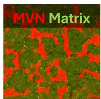  
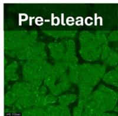
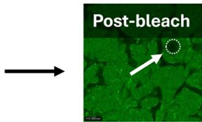  

(B)
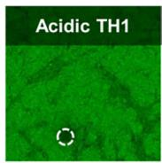  
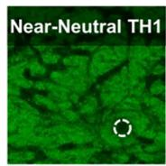
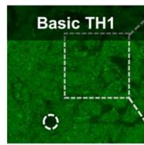
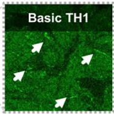

(C)
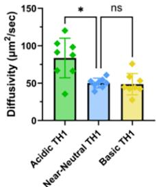

(D)
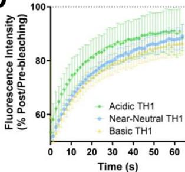  

(E)
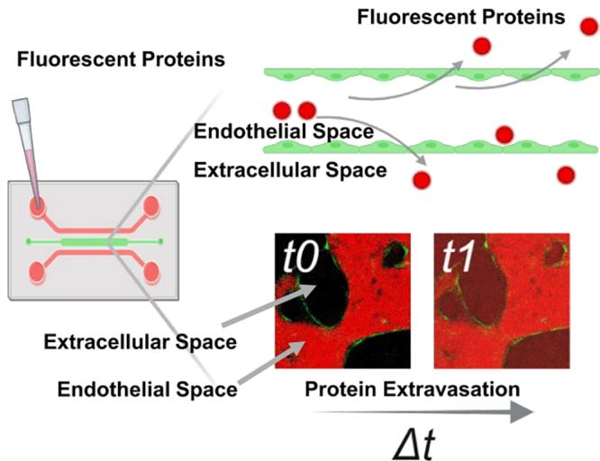  

(F)
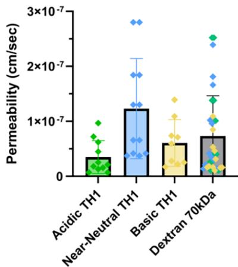  

(G)
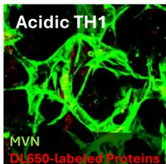  
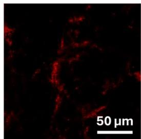
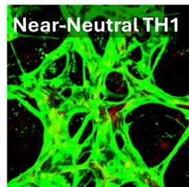
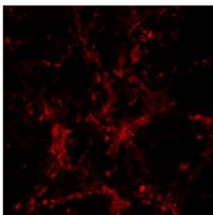
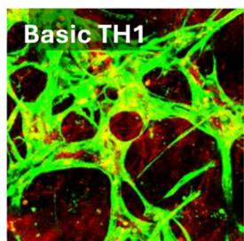
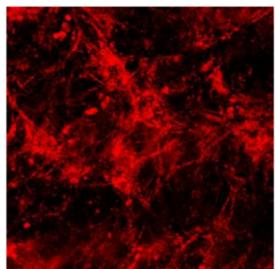
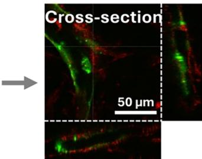  

우리는 리포좀 클로드로네이트를 통한 선택적 고갈을 활용하여 LCB1 전하 하위 세트의 조직 축적 및 전체 CL에서 대식세포의 잠재적 역할을 조사했습니다. 이러한 나노 입자의 생체 분포는 정맥 투여 후 주로 비장, 골수 및 간에 집중됩니다. 노출된 대식세포는 클로드로네이트 리포좀을 식균하여 결과적으로 사멸하게 되지만, 주변 세포 유형은 낮은 투과성과 유리 클로드로네이트의 신속한 제거로 인해 거의 영향을 받지 않습니다.[^58][^115] 클로드로네이트 및 대조군 리포좀은 3종의 LCB1 하위 세트 단백질 각각을 $2\mathrm{mg/kg}$ 정맥 볼루스 투여하기 2일 전에 주사되었습니다. 전하 하위 시리즈 연구와 조직 유형을 맞추기 위해 투여 후 0.5시간에 혈청, 간, 신장 및 비장을 수집했습니다. 추가로 흡수가 낮을 것으로 예상되는 대조 조직으로 근육을 수집했습니다. 예상된 리포좀 생체 분포와 일치하게, 어떤 LCB1 단백질에 대해서도 대조군과 클로드로네이트 탑재 리포좀 그룹 사이의 혈청 농도나 신장 및 근육의 조직/혈청 비율에서 유의미한 차이는 관찰되지 않았습니다(그림 7A,B). 테스트된 모든 LCB1 단백질의 비장 조직/혈청 비율과 농도는 리포좀 클로드로네이트를 투여받은 마우스에서 증가했으며(그림 7B, C), 이는 단백질 전하와 관계없이 이 조직 내의 순 축적에서 대식세포의 역할을 시사합니다.

그림 7. 리포좀 클로드로네이트 처리는 전체 LCB1 전하 시리즈의 비장 축적 증가를 초래한다. 야생형 C57BL/6J 마우스에 대조군 또는 클로드로네이트 탑재 리포좀을 정맥 볼루스 투여했습니다. 약 48시간 후 LCB1 전하 하위 시리즈를 정맥 투여하고 0.5시간 후에 조직과 혈청을 수집했습니다. (A) 클로드로네이트와 대조군 리포좀 그룹 간에 혈청 농도 차이는 관찰되지 않았습니다(이원 ANOVA 후 Sidak의 다중 비교 결과 ns, 유의성 없음). (B, C) 모든 LCB1 단백질은 대조군에 비해 상승된 비장/혈청 비율(B) 및 비장 농도(C)를 나타냈습니다. 또한 산성 pI LCB1 Fc 융합체의 경우 간/혈청 비율과 간 농도에서 유의미한 차이가 관찰되었습니다. ($^*p < 0.05, ^{**}p < 0.001$, ns, 유의하지 않음; 이원 ANOVA 후 Sidak의 다중 비교).

(A)
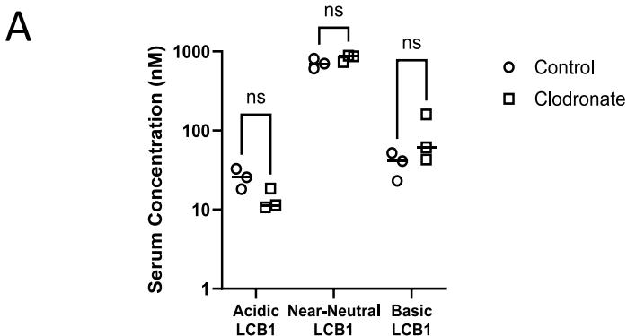

(B)

(C)

  

그림 8. 높은 표적 독립적 제거율을 유발하는 전하 주도 세포 기전. Fc 융합 단백질의 노출된 양전하와 세포막의 음이온성 영역 사이의 정전기적 상호작용은 흡착 비특이적 세포내섭취(NSE)를 매개하며, 이는 본 연구에서 Fc 융합체의 마우스 제거율(마우스 내 알려진 결합 파트너가 없으므로 표적 독립적 제거율)과 유의미하고 양의 상관관계를 나타냈습니다. 이는 NSE가 높은 Fc 함유 치료제가 세포당 비특이적으로 내부화되는 초기 양이 더 많아지게 하여, 리소좀 이화작용을 방지하기 위해 성공적인 FcRn 재활용을 거쳐야 하는 부담을 가중시킵니다. 내부화 이후 엔도좀 산성화는 pH 감소에 따른 양전하 증가로 인해 단백질 비특이성을 더욱 강화합니다. LCB1 및 TH1 하위 시리즈의 결과는 산성 pH에서의 세포 비특이성이 높은 NSE를 넘어서는 이유로 효율적인 FcRn 재활용에 해로운 영향을 미친다는 점을 시사합니다. Fc 영역 내부 및 외부의 노출된 양전하가 적절한 FcRn 결합 및 트래피킹 역학을 방해할 가능성이 큽니다. 가능한 원인으로는 FcRn에 결합하지 않거나 심지어 결합한 상태의 Fc 융합 단백질과 엔도좀 막 사이의 비특이적 상호작용, 그리고 세포 표면에서의 부적절한 pH 의존적 FcRn 해리 등이 있습니다. 즉, 높은 NSE를 촉진하는 동일한 요인들이 FcRn-Fc 융합 상호작용의 특이성도 저해하게 됩니다. 결과적으로 더 많은 비표적 세포가 더 많은 단백질을 내부화하고, 손상된 FcRn 역학으로 인해 성공적으로 재활용되는 총량이 줄어들며, 비특이적으로 내부화된 단백질 중 이화작용을 겪는 분율이 커지면서 제거 속도가 빨라집니다. 참고로 Fc 융합체와 hFcRn 상호작용은 해석의 용이성을 위해 단순화하여 표현되었습니다. 상세 내용은 고찰을 참조하십시오. BioRender.com을 사용하여 제작됨.

그림 8.
  

이러한 결과로부터 우리는 대식세포 매개 내부화가 조사된 단백질의 간 및 비장 진입에 반드시 영향을 미치는 것은 아닐지라도, 3종의 LCB1 Fc 융합체 모두에 대해 비장 조직 공간으로부터의 핵심 제거 요소임을 확인했습니다. 더욱이 음이온성 LCB1 단백질의 간 축적 증가가 유의미하게 나타난 것은, 다른 LCB1 변이체에 비해 이 전하 변이체의 경우 간 내 상주 대식세포가 장기 제거에서 더 큰 비중을 차지할 가능성을 시사합니다.

# 고찰

항체와 같은 치료용 Fc 단백질의 소실은 표적 매개 및 표적 독립적 과정의 조합에 의해 결정되며, 후자는 종종 간과되지만 마찬가지로 중요한 구성 요소입니다. 본 연구에서는 마우스 내에 알려진 내인성 표적이 없는 데 노보 단백질을 성공적으로 설계 및 제작하여 Fc 융합 단백질의 표적 독립적 소실을 주도하는 기전을 정의하였습니다. 이 패널은 pI 및 표면 패치 구성과 같은 광범위한 생물물리학적 특성을 포함하도록 계획되어 인 비보 및 세포 과정과의 관계를 탐색하였습니다. 본 연구의 결과는 단백질 표면에 노출된 양전하와 음전하를 띤 세포 구성 요소 사이의 정전기적 상호작용으로 인해 발생하는 세포 비특이성이 Fc 융합체 소실의 핵심 요소임을 보여줍니다.

인 실리코 전하 기술자와 제거율 사이의 상관관계는 개별 스캐폴드 내에서는 명확했지만 전체 데이터 세트에서는 그렇지 않았으며, 이는 스캐폴드 의존적인 한계를 강조합니다. 스캐폴드 내 상관관계는 백본 프레임워크가 일정하게 유지될 때 전하 기반 기술자가 미세한 수정에도 민감하게 반응함을 시사합니다. 그러나 스캐폴드 간 상관관계의 상실은 추가적인 스캐폴드 의존적 속성이 CL에 영향을 미침을 나타냅니다. 현재 특징 세트에는 형태 관련 기술자(예: 회전 반경 및 이심률)와 조성 기반 기술자(예: $\alpha$-헬릭스 및 $\beta$-시트 함량)가 포함되어 있지만, 본 연구의 제한된 스캐폴드 수를 고려할 때 이들이 PK의 스캐폴드 특이적 결정 요인을 충분히 포착하는지는 불분명합니다. 모델의 일반화 능력을 향상시키기 위해 스캐폴드 레퍼토리를 확장하는 것이 필수적이며, 구조적 기술자의 지속적인 정교화와 기저 생물학적 기전에 대한 깊은 이해를 통해 예측 PK 모델링의 획기적인 발전을 이룰 수 있을 것입니다.[^116]

표적이 없는 세포에 의한 비특이적 흡수 및 후속 제거는 항체 및 Fc 기반 치료제의 $\mathrm{CL}_{\mathrm{ind}}$에서 중요한 구성 요소입니다.[^32][^117-120] 본 연구는 전하 매개 비특이성이 NSE가 $\mathrm{CL}_{\mathrm{ind}}$ 상승에 기여하는 정도에 영향을 미친다는 점을 강조합니다(그림 8). 각 Fc 융합 구조 표면의 집중된 양전하는 pH 7.4에서의 상승된 NSE와 유의미한 상관관계가 있었습니다. 양전하 표면 패치가 감소된 항-IL-4R $\alpha$ 항체 점 돌연변이체에서 NSE가 감소함을 보여준 우리의 이전 보고와 결합하여, 치료용 단백질과 세포막 사이의 정전기적 상호작용이 흡착 NSE 속도를 결정하는 데 필수적이라고 결론지었습니다.[^44] 그러나 우리는 모든 Fc 융합 단백질에 걸친 NSE 양을 추론하는 데 있어 사용된 인 실리코 전하 기술자의 한계를 확인했으며, 이는 이러한 상호작용의 복잡성을 부각시킵니다. 향후 특정 단백질 스캐폴드 상의 전하 패치 위치에 따른 NSE의 민감도 등 물리화학적 관계를 정교화하는 연구는 이러한 과정을 더 잘 이해하고 NSE와 $\mathrm{CL}_{\mathrm{ind}}$를 줄이기 위한 단백질 공학 전략을 가이드하는 데 중요할 것입니다.

높은 NSE는 비표적 세포로 더 많은 단백질이 진입하게 하여 이화작용에 의한 분해 확률을 높입니다.[^30] 그러나 추가적인 세포 내 기전이 FcRn 발현 세포에서의 Fc 단백질 재활용 효율에 영향을 미칠 가능성이 큽니다. 우리는 다양한 단백질 형태에 걸쳐 용액 pH가 감소함에 따라 세포 비특이성이 강화될 수 있음을 보여주었습니다. 따라서 내부화된 Fc 단백질 중 가용성 분율에서 동적인 변화가 일어나 엔도좀 막에 대한 비특이적 표면 결합 수준이 높아질 수 있으며, 이는 FcRn으로의 접근을 차단할 수 있습니다. 비특이성은 또한 FcRn 결합 자체를 직접적으로 방해할 수도 있습니다. 이전 연구들은 항체 가변 영역이 FcRn과의 pH 의존적 상호작용에 미치는 영향을 지적했으며, 이는 부분적으로 전하 매개 과정에 기인할 수 있습니다.[^121] IgG는 FcRn에 결합할 때 여러 컨포메이션을 취할 수 있으며, 1:2의 화학양론적 결합이 기능성의 핵심으로 제안되었습니다.[^122-126] 이러한 결합 구조 내에서 Fab 암(arms)은 FcRn 및 엔도좀 막과 매우 가깝거나 직접 접촉하는 것으로 제안된 바 있습니다.[^125-128] 이러한 시나리오는 FcRn에 결합된 Fc 단백질에 대해서도 pH 의존적인 비특이적 정전기 상호작용이 가능함을 시사합니다. 즉, 중요한 Fc-FcRn 인터페이스 외부나 기저 엔도좀 막과의 부적절한 결합 이벤트가 발생할 수 있습니다. 이러한 결합 거동의 잠재적 결과로는 비정상적인 Fc-FcRn 결합 방향성 및/또는 세포 표면에서의 Fc 단백질 방출 시의 불균형한 pH 의존성 등이 있으며, 이는 결국 이화작용의 증가로 이어질 수 있습니다(그림 8). 이러한 기전적 시사점은 pH 의존적 해리를 통해 항원 결합을 조절하려는 단백질 설계 전략에 영향을 미쳐야 합니다.[^129] 그러나 이러한 가설을 확인하고 비특이성이 FcRn 결합에 어떻게 영향을 미치는지 상세히 밝히기 위해서는 구조, 생물물리학 및 세포 도구를 결합한 향후 연구가 필요할 것입니다.

야생형 마우스는 항체 및 Fc 함유 단백질 구조의 안정성, $\mathrm{CL}_{\mathrm{ind}}$ 및 생체 분포를 평가하고 이러한 거동을 주도하는 기저 과정을 연구하는 데 유용한 인 비보 도구입니다.[^34][^38][^77] 야생형 마우스의 주요 단점은 인간 PK 매개변수에 대한 정보 제공 능력이 마우스 FcRn과 인간 Fc 영역 사이의 종 특이적 결합 차이로 인해 본질적으로 제한된다는 점입니다.[^130] 형질전환 인간 FcRn 마우스 모델은 인간 FcRn과 인간 Fc의 결합을 더 적절하게 보존하며 인간 소실 특성에 대한 예측 능력이 더 높은 것으로 나타났으므로, 향후 마우스와 인간 PK 매개변수 사이의 보다 직접적인 인 비트로-인 비보 상관관계를 구축하려는 연구에 사용될 가치가 있습니다.[^131-133]

MVN 연구는 비특이성이 연속 내피층 내의 일반적인 단백질 이동에 어떻게 영향을 미칠 수 있는지 조사하기 위해 3D 세포 모델을 도입했습니다. 시스템에 미세 혈관이 존재할 때 중성 근처 및 염기성 pI를 가진 TH1 단백질 사이에서 간질 비이동 분율이나 확산 속도의 유의미한 차이는 측정되지 않았습니다. 또한 TH1 변이체 간에 정점-기저부 MVN 투과성의 측정 가능한 차이도 관찰되지 않았습니다. 이러한 인 비트로 도구를 사용한 발견은 간질 공간으로의 변화된 진입이나 이동이 연속 내피 내 조직 축적의 주요 요인이 아닐 수 있음을 나타냅니다. 간질 평가의 한 가지 한계는 조직 유형에 따라 매트릭스가 크게 다를 수 있다는 점이며, 사용된 MVN 모델이 대안적인 세포외 매트릭스 구성을 완전히 재현하지 못할 수 있습니다.[^36][^101-106][^134] 인 비트로 투과성 차이가 관찰되지 않은 한 가지 가능성은 TH1 단백질의 파라세포 MVN 수송이 횡단세포 이동을 압도할 정도로 발생했을 수 있다는 점입니다. 두 번째 가능성은 세포 내 트래피킹의 변화로 인해 양이온성 TH1 단백질의 기저부 출현이 지연되었거나 소낭 막 해리 역학이 수정되었을 수 있으며, 두 과정 모두 연구된 시간 범위 내에서 증가된 EC 외세포유출(exocytosis)을 포착하기에는 너무 느렸을 수 있습니다.[^93][^135] 따라서 우리는 이러한 과정 중 하나가 인 비보에서 양전하 TH1 단백질의 일반적인 축적에 기여하는 요인일 가능성을 배제할 수 없습니다.

MVN 관류 후 이미징 결과, 실험 시간 동안 모든 TH1 단백질이 EC와 연관성을 보였으며 특히 양성 TH1 변이체가 가장 높은 양으로 축적되었습니다. 이러한 데이터에 대한 한 가지 해석은 EC가 혈관을 성공적으로 통과할 수 있는 단백질의 분율을 결정하는 중추적인 역할을 한다는 것입니다. 따라서 정전기적으로 유도된 비특이성에 의한 EC 내부화 강화가 증가된 EC 정체 및 장벽을 가로지르는 순 유속 감소로 상쇄될 수 있습니다. 조직 공간 내에서도 동일한 비특이적 과정이 모든 간질 세포 내에서 발생할 수 있습니다. 따라서 우리의 2D 및 3D 배양 결과는 혈관 및 간질 세포 정체가 FcRn 발현 세포에서도 전하 매개 비특이성을 가진 Fc 함유 단백질의 조직 축적에 중추적인 요소임을 입증합니다. 이러한 결론은 내피 및 비혈관 세포 유형을 IgG 소실의 핵심 요소로 간주한 이전 보고들과 일치합니다.[^85-87][^136-139] 또한 데이터로부터 EC가 항체 기반 및 Fc 치료 모달리티에 대한 간질 단백질 농도의 중추적인 조절자임이 분명합니다.

그러나 여전히 많은 질문이 남아 있습니다. 연속 내피 내에서 FcRn은 어떤 역할을 하는가? 가로세포흐름을 촉진하는가? 아니면 루멘-루멘 재활용을 통해 혈관 단백질 농도를 유지함으로써 가로세포흐름을 방해하는가? 혹은 FcRn이 유의미한 역할을 전혀 하지 않는 것인가?[^65][^97][^140-141] 정확히 전하에 의해 EC 트래피킹과 순 단백질 투과성이 어떻게 영향을 받는가?[^93] 이러한 질문들과 더불어 많은 미지의 문제들은 치료 분자의 혈관외 유출을 향상시키기 위한 새로운 기술로 이어질 수 있는 EC를 통한 Fc 단백질의 횡단세포 이동(즉, 상피가 아닌 내피)을 지속적으로 탐구할 필요성을 시사합니다.[^142]

고도로 음이온성인 Fc 융합 단백질의 증가된 혈청 제거 및 조직 축적을 유발하는 정확한 기전은 여전히 불분명합니다. 클로드로네이트 탑재 리포좀 실험은 평가된 모든 LCB1 전하 변이체의 비장 축적에 대식세포가 기여함을 시사했습니다. 이 실험 설계는 SR이 전체 소실에 관여하는지를 직접 조사하지는 않았다는 한계가 있습니다. 오히려 SR을 발현하는 세포 유형의 역할을 뒷받침하는 초기 데이터를 제공했습니다. 잠재적 후보군의 범위(예: stabilin 1 및 2, STAB1, STAB2; SR class A, MSR1; 렉틴 유사 산화 저밀도 지질단백질 수용체-1, LOX1)를 고려할 때, 표면 전하 특성이 Fc 융합체의 SR 매개 세포내섭취에 미치는 영향을 정밀하게 평가하는 전용 연구가 향후 필요할 것입니다. 이러한 연구는 특이성을 입증하기 위한 기 알려진 음이온 리간드와의 인 비트로 및 인 비보 경쟁 실험,[^107][^143-144] 세포 기반 마이크로어레이 결합 분석과 같은 유전학 기술,[^145] 그리고 다른 SR 발현 세포 유형(예: 간 시누소이드 EC)에 대한 조사 등을 포함해야 합니다.[^146] 또한 음이온성 Fc 융합 단백질 인식에 관여하는 SR의 다양성은 리포좀 클로드로네이트 투여 후 LCB1 혈청 농도에서 관찰 가능한 변화가 없었던 이유가 교차 리간드 인식 및 후속적으로 하나 이상의 대안적 세포 유형에서 발생한 보상 작용 때문이었을 가능성도 시사합니다.

SR 외에도 고도로 음이온성인 Fc 융합 단백질의 상승된 CL에 대한 두 번째 가능한 기전은 신장 제거 증가일 수 있습니다. 일반적으로 Fc 융합 단백질의 신장 제거는 사구체 여과, 근위 세관 재흡수, 루멘 또는 세포 내 이화작용 및 소변 배설로 구성됩니다.[^147] 알부민의 경우처럼 사구체에서 여과된 대부분의 Fc 단백질을 근위 세관에서 내부화한 뒤 혈관으로 다시 FcRn 매개 가로세포흐름을 시킬 것으로 예상됩니다.[^148-149] 따라서 여과량, 근위 세관 내부화 또는 근위 세관 FcRn 재활용 효율의 변화는 신장 제거를 증가시킬 것으로 예상됩니다. 사구체 전하 선택성 개념에 따르면 음이온성 단백질의 사구체 여과는 양이온성 대조군보다 낮을 것으로 예상됩니다.[^150-154] 별개의 가능성으로는 음이온성 단백질의 수력학적 크기나 전체적인 유연성의 보다 극적인 변화가 포함될 수 있으며, 이는 이전에 바이오 의약품의 여과에 영향을 미치는 것으로 밝혀진 바 있습니다.[^155] 내부화 측면에서, 우리는 단백질의 정전기적 표면 특성이 근위 세관 상피 세포에 의한 수용체 의존적 및 독립적 세포내섭취에 미치는 영향을 규명한 상세 연구를 알지 못하지만, 이전 보고에서는 마우스 알부민의 음이온성 변이체가 근위 세관 가로세포흐름을 겪을 수 있음을 보여주었습니다.[^156] 또한 우리의 MDCK II 세포 연구는 음이온성 단백질 변이체의 비정상적인 hFcRn 재활용을 나타내지 않았습니다. 전반적으로 음이온성 단백질 제거에 대한 기전적 미지수는 각 장기 내 단백질 소실의 이질성을 강조하며 본 연구의 범위를 벗어나는 상세한 조직 특이적 연구의 필요성을 부각시킵니다.

# 결론

표적 독립적 분포 및 제거의 시공간적 측면은 조직마다 다를 것이며, 이를 완전히 특성화하기 위해서는 세포 이질성, 장기 생리학, 특정 조직 내 단백질 이동 역학에 대한 깊은 이해와 더불어 계산 PK 모델링의 통합이 필요합니다.[^157-160] 특정 비표적 결합, 서로 다른 내피 유형에 따른 투과성, 내피 당질층의 영향, SR에 의한 인식 등 Fc 융합 단백질 및 항체 기반 치료제에 대해 다양한 가능성과 변동이 존재합니다.[^22][^145][^157][^161-165] 본 연구는 세포 비특이성과 마우스 $\mathrm{CL}_{\mathrm{ind}}$ 및 생체 분포 사이의 관계, 그리고 물리화학적 속성이 이러한 행동을 어떻게 주도할 수 있는지에 대한 통합적인 조사를 나타냅니다. Fc 단백질 소실에 대한 이해를 계속 높이기 위해서는 우리의 관찰을 바탕으로 한 추가적인 연구가 필요할 것입니다.

기전적 통찰과 더불어 우리의 연구는 단백질 치료제의 $\mathrm{CL}_{\mathrm{ind}}$를 낮추기 위해 노출된 양전하를 줄이는 일반적인 전략을 뒷받침합니다. 이는 $\mathrm{CL}_{\mathrm{ind}}$ 감소를 위한 최소한의 엔지니어링 가능성을 부각시키지만[^22][^37], 표적 항원 상호작용을 보존해야 할 뿐만 아니라 전하 조절의 정도를 제한해야 할 필요성도 수반합니다. 고도로 음이온성인 Fc 융합 단백질의 마우스 CL 및 조직 축적 증가 기전을 완벽히 설명하지는 못했음에도 불구하고, 우리는 소실에 해로운 영향을 미치는 음전하 임계값이 존재한다는 정보를 제공했습니다.[^36][^38] 따라서 다른 제조 가능성 고려 사항과 별개로 PK 관점에서 과도한 양전하 패치를 완화하기 위한 설계는 무조건적인 전하 감소만을 목표로 해서는 안 됩니다. 오히려 특정 지역의 돌연변이가 세포 처리 및 소실을 어떻게 변화시킬지에 대한 정교한 이해가 필요합니다. 보다 예측력 있는 인 비트로-인 비보 관계를 얻기 위해 개선된 물리화학적 기술자를 식별하는 것은 엄청난 이점이 될 것입니다. 단백질 치료제 소실에 대한 이해를 지속적으로 높이는 과정은 문제 소지가 있는 표면 핫스팟(hotspots)을 더 잘 매핑하거나 심지어 비정상적인 물리화학적 특성을 데 노보로 예측할 수 있는 혁신적인 약리학적 전략 및 계산 도구의 지속적인 개발과 병행되어야 합니다.[^166-167]

# 관련 콘텐츠

## 지원 정보

지원 정보는 https://pubs.acs.org/doi/10.1021/acs.molpharma-uct.5c01228 에서 무료로 이용할 수 있다.

모든 Fc 융합 단백질에 대한 분석 결과; 마우스 제거율과 인 실리코 및 인 비트로 파라미터 간의 스피어만 상관관계 결과; 전체 Fc 융합 단백질 패널의 모든 물리화학적 기술자 값; 본 연구에서 사용된 각 물리화학적 기술자의 정의; TH1 전하 하위 시리즈에 대한 MVN 유무에 따른 비이동 분율 계산 비교; Fc 융합 단백질 분자량에 따른 제거율 또는 혈청 노출 차이 부재, 그리고 Fc 융합 스캐폴드 내에서의 pI_seq 및 patch_pos_%와 마우스 제거율 간의 상관관계; 본 연구에서 분석된 모든 단백질의 CHO-K1 NSE 값, 스캐폴드 내에서의 CHO-K1 NSE와 마우스 제거율 간의 상관관계, pH 7.4 및 pH 5.8에서 측정된 CHO-K1 NSE 간의 관계; 모든 Fc 융합 단백질에 사용된 어떠한 소수성 기술자와도 pH 7.4에서의 CHO-K1 NSE 사이의 관찰 가능한 관계가 없음을 입증; pH 7.4에서의 CHO-K1 NSE와 pI_seq 및 patch_pos % 사이의 강력한 스캐폴드 내 상관관계 확립; TH1 및 LCB1 하위 시리즈의 FREM 점수 계산에 사용된 모든 MDCK 세포 분석 결과; DL650 또는 FITC 접합 후 TH1 하위 시리즈의 icIEF 크로마토그램; 세포 유무에 따른 3D 미세 생리학 시스템에서의 TH1 하위 시리즈의 간질 거동 등 (PDF)

* Fc 융합 단백질의 분석 요약 (XLSX)
* 스피어만 상관관계 매트릭스 및 해당 p 값 (XLSX)
* Fc 융합 패널의 물리화학적 기술자 (XLSX)
* 물리화학적 기술자의 정의 (XLSX)
* MVN 존재 여부에 따른 단백질의 비이동 분율 (XLSX)

# 참고 문헌

[^1]: Keri, D.; Walker, M.; Singh, I.; Nishikawa, K.; Garces, F. Next generation of multispecific antibody engineering. *Anti. Ther.* **2024**, *7*, 37-52.   
[^2]: Lucchi, R.; Bentanachs, J.; Oller-Salvia, B. The Masking Game: Design of Activatable Antibodies and Mimetics for Selective Therapeutics and Cell Control. *ACS Cent. Sci.* **2021**, *7*, 724-738.
[^3]: Husain, B.; Ellerman, D. Expanding the Boundaries of Biotherapeutics with Bispecific Antibodies. *BioDrugs* **2018**, *32*, 441-464.   
[^4]: Deshaies, R. J. Multispecific drugs herald a new era of biopharmaceutical innovation. *Nature* **2020**, *580*, 329-338.   
[^5]: Labrijn, A. F.; Janmaat, M. L.; Reichert, J. M.; Parren, P. Bispecific antibodies: a mechanistic review of the pipeline. *Nat. Rev. Drug Discov.* **2019**, *18*, 585-608.   
[^6]: Ebrahimi, S. B.; Samanta, D. Engineering protein-based therapeutics through structural and chemical design. *Nat. Commun.* **2023**, *14*, 2411.   
[^7]: Berger, S.; Seeger, F.; Yu, T. Y.; Aydin, M.; Yang, H.; Rosenblum, D.; Guenin-Mace, L.; Glassman, C.; Arguinchona, L.; Sniezek, C.; et al. Preclinical proof of principle for orally delivered Th17 antagonist miniproteins. *Cell* **2024**, *187*, 4305-4317.e18.   
[^8]: Chevalier, A.; Silva, D. A.; Rocklin, G. J.; Hicks, D. R.; Vergara, R.; Murapa, P.; et al. Massively parallel de novo protein design for targeted therapeutics. *Nature* **2017**, *550*, 74-79.   
[^9]: Silva, D. A.; Yu, S.; Ulge, U. Y.; Spangler, J. B.; Jude, K. M.; Labao-Almeida, C.; et al. De novo design of potent and selective mimics of IL-2 and IL-15. *Nature* **2019**, *565*, 186-191.   
[^10]: Dostalek, M.; Prueksaritanont, T.; Kelley, R. F. Pharmacokinetic de-risking tools for selection of monoclonal antibody lead candidates. *MAbs* **2017**, *9*, 756-766.   
[^11]: Jain, T.; Prinz, B.; Marker, A.; Michel, A.; Reichel, K.; Czepczor, V.; et al. Assessment and incorporation of in vitro correlates to pharmacokinetic outcomes in antibody developability workflows. *MAbs* **2024**, *16*, 2384104.   
[^12]: Sharma, V. K.; Patapoff, T. W.; Kabakoff, B.; Pai, S.; Hilario, E.; Zhang, B.; et al. In silico selection of therapeutic antibodies for development: viscosity, clearance, and chemical stability. *Proc. Natl. Acad. Sci. U.S.A.* **2014**, *111*, 18601-18606.   
[^13]: Bailly, M.; Mieczkowski, C.; Juan, V.; Metwally, E.; Tomazela, D.; Baker, J.; et al. Predicting Antibody Developability Profiles Through Early Stage Discovery Screening. *MAbs* **2020**, *12*, 1743053.   
[^14]: Grinshpun, B.; Thorsteinson, N.; Pereira, J. N.; Rippmann, F.; Nannemann, D.; Sood, V. D.; Fomekong Nanfack, Y. Identifying biophysical assays and in silico properties that enrich for slow clearance in clinical-stage therapeutic antibodies. *MAbs* **2021**, *13*, 1932230.   
[^15]: Avery, L. B.; Wade, J.; Wang, M.; Tam, A.; King, A.; Piche-Nicholas, N.; et al. Establishing in vitro in vivo correlations to screen monoclonal antibodies for physicochemical properties related to favorable human pharmacokinetics. *MAbs* **2018**, *10*, 244-255.   
[^16]: Ahmed, L.; Gupta, P.; Martin, K. P.; Scheer, J. M.; Nixon, A. E.; Kumar, S. Intrinsic physicochemical profile of marketed antibody-based biotherapeutics. *Proc. Natl. Acad. Sci. U.S.A.* **2021**, *118*, No. e2020577118.   
[^17]: Makowski, E. K.; Wu, L.; Gupta, P.; Tessier, P. M. Discovery-stage identification of drug-like antibodies using emerging experimental and computational methods. *MAbs* **2021**, *13*, 1895540.   
[^18]: Mock, M.; Jacobitz, A. W.; Langmead, C. J.; Sudom, A.; Yoo, D.; Humphreys, S. C.; et al. Development of in silico models to predict viscosity and mouse clearance using a comprehensive analytical data set collected on 83 scaffold-consistent monoclonal antibodies. *MAbs* **2023**, *15*, 2256745.   
[^19]: Ausserwoger, H.; Schneider, M. M.; Herling, T. W.; Arosio, P.; Invernizzi, G.; Knowles, T. P. J.; Lorenzen, N. Non-specificity as the sticky problem in therapeutic antibody development. *Nat. Rev. Chem.* **2022**, *6*, 844-861.   
[^20]: Jain, T.; Sun, T.; Durand, S.; Hall, A.; Houston, N. R.; Nett, J. H.; et al. Biophysical properties of the clinical-stage antibody landscape. *Proc. Natl. Acad. Sci. U.S.A.* **2017**, *114*, 944-949.   
[^21]: Tibbitts, J.; Canter, D.; Graff, R.; Smith, A.; Khawli, L. A. Key factors influencing ADME properties of therapeutic proteins: A need for ADME characterization in drug discovery and development. *MAbs* **2016**, *8*, 229-245.   
[^22]: Datta-Mannan, A. Mechanisms Influencing the Pharmacokinetics and Disposition of Monoclonal Antibodies and Peptides. *Drug Metab. Dispos.* **2019**, *47*, 1100-1110.
[^23]: Liu, L. Pharmacokinetics of monoclonal antibodies and Fc-fusion proteins. *Protein Cell* **2018**, *9*, 15-32.   
[^24]: Rath, T.; Baker, K.; Dumont, J. A.; Peters, R. T.; Jiang, H.; Qiao, S. W.; et al. Fc-fusion proteins and FcRn: structural insights for longer-lasting and more effective therapeutics. *Crit. Rev. Biotechnol.* **2015**, *35*, 235-254.   
[^25]: Silverstein, S. C.; Steinman, R. M.; Cohn, Z. A. Endocytosis. *Annu. Rev. Biochem.* **1977**, *46*, 669-722.   
[^26]: Besterman, J. M.; Low, R. B. Endocytosis: a review of mechanisms and plasma membrane dynamics. *Biochem. J.* **1983**, *210*, 1-13.   
[^27]: Steinman, R. M.; Mellman, I. S.; Muller, W. A.; Cohn, Z. A. Endocytosis and the recycling of plasma membrane. *J. Cell Biol.* **1983**, *96*, 1-27.   
[^28]: Mellman, I.; Fuchs, R.; Helenius, A. Acidification of the endocytic and exocytic pathways. *Annu. Rev. Biochem.* **1986**, *55*, 663-700.   
[^29]: Pyzik, M.; Kozicky, L. K.; Gandhi, A. K.; Blumberg, R. S. The therapeutic age of the neonatal Fc receptor. *Nat. Rev. Immunol.* **2023**, *23*, 415-432.   
[^30]: Ghetie, V.; Ward, E. S. Transcytosis and catabolism of antibody. *Immunol. Res.* **2002**, *25*, 097-114.   
[^31]: Ward, E. S.; Ober, R. J. Chapter 4: Multitasking by exploitation of intracellular transport functions the many faces of FcRn. *Adv. Immunol.* **2009**, *103*, 77-115.   
[^32]: Ward, E. S.; Ober, R. J. Commentary: "There's been a Flaw in Our Thinking". *Front. Immunol.* **2015**, *6*, 351.   
[^33]: Gurbaxani, B.; Dostalek, M.; Gardner, I. Are endosomal trafficking parameters better targets for improving mAb pharmacokinetics than FcRn binding affinity? *Mol. Immunol.* **2013**, *56*, 660-674.   
[^34]: Kelly, R. L.; Sun, T.; Jain, T.; Caffry, I.; Yu, Y.; Cao, Y.; et al. High throughput cross-interaction measures for human IgG1 antibodies correlate with clearance rates in mice. *MAbs* **2015**, *7*, 770-777.   
[^35]: Hotzel, I.; Theil, F. P.; Bernstein, L. J.; Prabhu, S.; Deng, R.; Quintana, L.; et al. A strategy for risk mitigation of antibodies with fast clearance. *MAbs* **2012**, *4*, 753-760.   
[^36]: Boswell, C. A.; Tesar, D. B.; Mukhyala, K.; Theil, F. P.; Fielder, P. J.; Khawli, L. A. Effects of charge on antibody tissue distribution and pharmacokinetics. *Bioconjug. Chem.* **2010**, *21*, 2153-2163.   
[^37]: Igawa, T.; Tsunoda, H.; Tachibana, T.; Maeda, A.; Mimoto, F.; Moriyama, C.; et al. Reduced elimination of IgG antibodies by engineering the variable region. *Protein Eng. Des. Sel.* **2010**, *23*, 385-392.   
[^38]: Liu, S.; Verma, A.; Kettenberger, H.; Richter, W. F.; Shah, D. K. Effect of variable domain charge on in vitro and in vivo disposition of monoclonal antibodies. *MAbs* **2021**, *13*, 1993769.   
[^39]: Bumbaca Yadav, D.; Sharma, V. K.; Boswell, C. A.; Hotzel, I.; Tesar, D.; Shang, Y.; et al. Evaluating the Use of Antibody Variable Region (Fv) Charge as a Risk Assessment Tool for Predicting Typical Cynomolgus Monkey Pharmacokinetics. *J. Biol. Chem.* **2015**, *290*, 29732-29741.   
[^40]: Ausserwoger, H.; Krainer, G.; Welsh, T. J.; Thorsteinson, N.; de Csillery, E.; Sneideris, T.; et al. Surface patches induce nonspecific binding and phase separation of antibodies. *Proc. Natl. Acad. Sci. U.S.A.* **2023**, *120*, No. e2210332120.   
[^41]: Datta-Mannan, A.; Thangaraju, A.; Leung, D.; Tang, Y.; Witcher, D. R.; Lu, J.; Wroblewski, V. J. Balancing charge in the complementarity-determining regions of humanized mAbs without affecting pI reduces nonspecific binding and improves the pharmacokinetics. *MAbs* **2015**, *7*, 483-493.   
[^42]: Datta-Mannan, A.; Lu, J.; Witcher, D. R.; Leung, D.; Tang, Y.; Wroblewski, V. J. The interplay of nonspecific binding, target-mediated clearance and FcRn interactions on the pharmacokinetics of humanized antibodies. *MAbs* **2015**, *7*, 1084-1093.   
[^43]: Triguero, D.; Buciak, J. L.; Pardridge, W. M. Cationization of immunoglobulin G results in enhanced organ uptake of the protein after intravenous administration in rats and primate. *J. Pharmacol. Exp. Ther.* **1991**, *258*, 186-192.
[^44]: Bryniarski, M. A.; Tuhin, M. T. H.; Shomin, C. D.; Nasrollahi, F.; Ko, E. C.; Soto, M.; et al. Utility of Cellular Measurements of Non-Specific Endocytosis to Assess the Target-Independent Clearance of Monoclonal Antibodies. *J. Pharm. Sci.* **2024**, *113*, 3100.   
[^45]: Bryniarski, M. A.; Tuhin, M. T. H.; Acker, T. M.; Wakefield, D. L.; Sethaputra, P. G.; Cook, K. D.; et al. Cellular Neonatal Fc Receptor Recycling Efficiencies can Differentiate Target-Independent Clearance Mechanisms of Monoclonal Antibodies. *J. Pharm. Sci.* **2024**, *113*, 2879–2894.   
[^46]: Grevys, A.; Frick, R.; Mester, S.; Flem-Karlsen, K.; Nilsen, J.; Foss, S.; et al. Antibody variable sequences have a pronounced effect on cellular transport and plasma half-life. *iScience* **2022**, *25*, 103746.   
[^47]: Gjolberg, T. T.; Frick, R.; Mester, S.; Foss, S.; Grevys, A.; Hoydahl, L. S.; et al. Biophysical differences in IgG1 Fc-based therapeutics relate to their cellular handling, interaction with FcRn and plasma half-life. *Commun. Biol.* **2022**, *5*, 832.   
[^48]: Schoch, A.; Kettenberger, H.; Mundigl, O.; Winter, G.; Engert, J.; Heinrich, J.; Emrich, T. Charge-mediated influence of the antibody variable domain on FcRn-dependent pharmacokinetics. *Proc. Natl. Acad. Sci. U.S.A.* **2015**, *112*, 5997-6002.   
[^49]: Chung, S.; Nguyen, V.; Lin, Y. L.; Lafrance-Vanasse, J.; Scales, S. J.; Lin, K.; et al. An in vitro FcRn-dependent transcytosis assay as a screening tool for predictive assessment of nonspecific clearance of antibody therapeutics in humans. *MAbs* **2019**, *11*, 942-955.   
[^50]: Rocklin, G. J.; Chidyausiku, T. M.; Goreshnik, I.; Ford, A.; Houliston, S.; Lemak, A.; et al. Global analysis of protein folding using massively parallel design, synthesis, and testing. *Science* **2017**, *357*, 168-175.   
[^51]: Koga, N.; Tatsumi-Koga, R.; Liu, G.; Xiao, R.; Acton, T. B.; Montelione, G. T.; Baker, D. Principles for designing ideal protein structures. *Nature* **2012**, *491*, 222-227.   
[^52]: Huang, P. S.; Feldmeier, K.; Parmeggiani, F.; Fernandez Velasco, D. A.; Hocker, B.; Baker, D. De novo design of a four-fold symmetric TIM-barrel protein with atomic-level accuracy. *Nat. Chem. Biol.* **2016**, *12*, 29-34.   
[^53]: Cao, L.; Goreshnik, I.; Coventry, B.; Case, J. B.; Miller, L.; Kozodoy, L.; et al. De novo design of picomolar SARS-CoV-2 miniprotein inhibitors. *Science* **2020**, *370*, 426-431.   
[^54]: Huddy, T. F.; Hsia, Y.; Kibler, R. D.; Xu, J.; Bethel, N.; Nagarajan, D.; et al. Blueprinting extendable nanomaterials with standardized protein blocks. *Nature* **2024**, *627*, 898-904.   
[^55]: Estes, B.; Sudom, A.; Gong, D.; Whittington, D. A.; Li, V.; Mohr, C.; et al. Next generation Fc scaffold for multispecific antibodies. *iScience* **2021**, *24*, 103447.   
[^56]: Sun, H.; Wang, S.; Lu, M.; Tinberg, C. E.; Alba, B. M. Protein production from HEK293 cell line-derived stable pools with high protein quality and quantity to support discovery research. *PLoS One* **2023**, *18*, No. e0285971.   
[^57]: Jumper, J.; Evans, R.; Pritzel, A.; Green, T.; Figurnov, M.; Ronneberger, O.; et al. Highly accurate protein structure prediction with AlphaFold. *Nature* **2021**, *596*, 583-589.   
[^58]: van Rooijen, N.; Hendrikx, E. Liposomes for Specific Depletion of Macrophages from Organs and Tissues. *Mol. Biol.* **2010**, *605*, 189-203.   
[^59]: Grevys, A.; Nilsen, J.; Sand, K. M. K.; Daba, M. B.; Oynebraten, I.; Bern, M.; et al. A human endothelial cell-based recycling assay for screening of FcRn targeted molecules. *Nat. Commun.* **2018**, *9*, 621.   
[^60]: Offeddu, G. S.; Serrano, J. C.; Wan, Z.; Bryniarski, M. A.; Humphreys, S. C.; Chen, S. W.; et al. Microphysiological endothelial models to characterize subcutaneous drug absorption. *ALTEX* **2023**, *40*, 299-313.   
[^61]: Hajal, C.; Offeddu, G. S.; Shin, Y.; Zhang, S.; Morozova, O.; Hickman, D.; et al. Engineered human blood-brain barrier microfluidic model for vascular permeability analyses. *Nat. Protoc.* **2022**, *17*, 95-128.   
[^62]: Guido van Rossum, F. L. D. *Python 3 Reference Manual*; CreateSpace: Scotts Valley, CA, 2009.
[^63]: Berg, S.; Kutra, D.; Kroeger, T.; Straehle, C. N.; Kausler, B. X.; Haubold, C.; et al. ilastik: interactive machine learning for (bio)image analysis. *Nat. Methods* **2019**, *16*, 1226-1232.   
[^64]: Foundation, P. S. Python 3.13.2 documentation; https://docs.python.org/3/library/subprocess.html, 2025. Accessed Nov 11, 2025.   
[^65]: Offeddu, G. S.; Haase, K.; Gillrie, M. R.; Li, R.; Morozova, O.; Hickman, D.; et al. An on-chip model of protein paracellular and transcellular permeability in the microcirculation. *Biomaterials* **2019**, *212*, 115-125.   
[^66]: Kang, M.; Day, C. A.; Kenworthy, A. K.; DiBenedetto, E. Simplified equation to extract diffusion coefficients from confocal FRAP data. *Traffic* **2012**, *13*, 1589-1600.   
[^67]: Yoon, S.; Penzes, P. A fluorescence recovery after photobleaching protocol to measure surface diffusion of DAGL $\alpha$ in primary cultured cortical mouse neurons. *STAR Protoc.* **2022**, *3*, 101118.   
[^68]: Romero-Romero, S.; Costas, M.; Silva Manzano, D. A.; Kordes, S.; Rojas-Ortega, E.; Tapia, C.; et al. The Stability Landscape of de novo TIM Barrels Explored by a Modular Design Approach. *J. Mol. Biol.* **2021**, *433*, 167153.   
[^69]: Caldwell, S. J.; Haydon, I. C.; Piperidou, N.; Huang, P. S.; Bick, M. J.; Sjostrom, H. S.; et al. Tight and specific lanthanide binding in a de novo TIM barrel with a large internal cavity designed by symmetric domain fusion. *Proc. Natl. Acad. Sci. U.S.A.* **2020**, *117*, 30362-30369.   
[^70]: Dauparas, J.; Anishchenko, I.; Bennett, N.; Bai, H.; Ragotte, R. J.; Milles, L. F.; et al. Robust deep learning-based protein sequence design using ProteinMPNN. *Science* **2022**, *378*, 49-56.   
[^71]: Tunyasuvunakool, K.; Adler, J.; Wu, Z.; Green, T.; Zielinski, M.; Zidek, A.; et al. Highly accurate protein structure prediction for the human proteome. *Nature* **2021**, *596*, 590-596.   
[^72]: Liu, L.; Jacobsen, F. W.; Everds, N.; Zhuang, Y.; Yu, Y. B.; Li, N.; et al. Biological Characterization of a Stable Effector Functionless (SEFL) Monoclonal Antibody Scaffold in Vitro. *J. Biol. Chem.* **2017**, *292*, 1876-1883.   
[^73]: Rafidi, H.; Rajan, S.; Urban, K.; Shatz-Binder, W.; Hui, K.; Ferl, G. Z.; et al. Effect of molecular size on interstitial pharmacokinetics and tissue catabolism of antibodies. *MAbs* **2022**, *14*, 2085535.   
[^74]: Eigenmann, M. J.; Fronton, L.; Grimm, H. P.; Otteneder, M. B.; Krippendorff, B. F. Quantification of IgG monoclonal antibody clearance in tissues. *MAbs* **2017**, *9*, 1007-1015.   
[^75]: Chen, N.; Wang, W.; Fauty, S.; Fang, Y.; Hamuro, L.; Hussain, A.; Prueksaritanont, T. The effect of the neonatal Fc receptor on human IgG biodistribution in mice. *MAbs* **2014**, *6*, 502-508.   
[^76]: Covell, D. G.; Barbet, J.; Holton, O. D.; Black, C. D.; Parker, R. J.; Weinstein, J. N. Pharmacokinetics of monoclonal immunoglobulin G1, F(ab')2, and Fab' in mice. *Cancer Res.* **1986**, *46*, 3969-3978.   
[^77]: Shah, D. K.; Betts, A. M. Antibody biodistribution coefficients: inferring tissue concentrations of monoclonal antibodies based on the plasma concentrations in several preclinical species and human. *MAbs* **2013**, *5*, 297-305.   
[^78]: Stüber, J. C.; Rechberger, K. F.; Miladinović, S. M.; Pöschinger, T.; Zimmermann, T.; Villenave, R.; et al. Impact of charge patches on tumor disposition and biodistribution of therapeutic antibodies. *AAPS Open* **2022**, *8*, 3.   
[^79]: Wright, A.; Sato, Y.; Okada, T.; Chang, K.; Endo, T.; Morrison, S. In vivo trafficking and catabolism of IgG1 antibodies with Fc associated carbohydrates of differing structure. *Glycobiology* **2000**, *10*, 1347-1355.   
[^80]: Cleaver, O.; Melton, D. A. Endothelial signaling during development. *Nat. Med.* **2003**, *9*, 661-668.   
[^81]: Trimm, E.; Red-Horse, K. Vascular endothelial cell development and diversity. *Nat. Rev. Cardiol.* **2023**, *20*, 197-210.   
[^82]: Fung, K. Y. Y.; Fairn, G. D.; Lee, W. L. Transcellular vesicular transport in epithelial and endothelial cells: Challenges and opportunities. *Traffic* **2018**, *19*, 5-18.   
[^83]: Aird, W. C. Phenotypic heterogeneity of the endothelium: I. Structure, function, and mechanisms. *Circ. Res.* **2007**, *100*, 158-173.   
[^84]: Aird, W. C. Phenotypic heterogeneity of the endothelium: II. Representative vascular beds. *Circ. Res.* **2007**, *100*, 174-190.
[^85]: Borvak, J.; Richardson, J.; Medesan, C.; Antohe, F.; Radu, C.; Simionescu, M.; et al. Functional expression of the MHC class I-related receptor, FcRn, in endothelial cells of mice. *Int. Immunol.* **1998**, *10*, 1289-1298.   
[^86]: Challa, D. K.; Wang, X.; Montoyo, H. P.; Velmurugan, R.; Ober, R. J.; Ward, E. S. Neonatal Fc receptor expression in macrophages is indispensable for IgG homeostasis. *MAbs* **2019**, *11*, 848-860.   
[^87]: Akilesh, S.; Christianson, G. J.; Roopenian, D. C.; Shaw, A. S. Neonatal FcR expression in bone marrow-derived cells functions to protect serum IgG from catabolism. *J. Immunol.* **2007**, *179*, 4580-4588.   
[^88]: Ono, S.; Egawa, G.; Kabashima, K. Regulation of blood vascular permeability in the skin. *Regen* **2017**, *37*, 11.   
[^89]: Tuma, P.; Hubbard, A. L. Transcytosis: crossing cellular barriers. *Physiol. Rev.* **2003**, *83*, 871-932.   
[^90]: Predescu, D.; Vogel, S. M.; Malik, A. B. Functional and morphological studies of protein transcytosis in continuous endothelia. *Am. J. Physiol. Lung Cell. Mol. Physiol.* **2004**, *287*, L895-L901.   
[^91]: Renkin, E. M. Transport Pathways and Processes. In *Endothelial Cell Biology in Health and Disease*; Simionescu, N., Simionescu, M., Eds.; Springer US: Boston, MA, 1988; pp 51-68.   
[^92]: Simionescu, M.; Gafencu, A.; Antohe, F. Transcytosis of plasma macromolecules in endothelial cells: a cell biological survey. *Microsc. Res. Tech.* **2002**, *57*, 269-288.   
[^93]: Simionescu, M.; Simionescu, N. Endothelial transport of macromolecules: transcytosis and endocytosis. A look from cell biology. *Cell Biol. Rev.* **1991**, *2S*, 1-78.   
[^94]: Michel, C. C. Transport of macromolecules through microvascular walls. *Cardiovasc Res.* **1996**, *32*, 644-653.   
[^95]: Michel, C. C.; Curry, F. E. Microvascular permeability. *Physiol. Rev.* **1999**, *79*, 703-761.   
[^96]: Mehta, D.; Malik, A. B. Signaling mechanisms regulating endothelial permeability. *Physiol. Rev.* **2006**, *86*, 279-367.   
[^97]: Ono, S.; Egawa, G.; Nomura, T.; Kitoh, A.; Dainichi, T.; Otsuka, A.; et al. Abl family tyrosine kinases govern IgG extravasation in the skin in a murine pemphigus model. *Nat. Commun.* **2019**, *10*, 4432.   
[^98]: Li, Z.; Krippendorff, B. F.; Sharma, S.; Walz, A. C.; Lave, T.; Shah, D. K. Influence of molecular size on tissue distribution of antibody fragments. *MAbs* **2016**, *8*, 113-119.   
[^99]: Garlick, D. G.; Renkin, E. M. Transport of large molecules from plasma to interstitial fluid and lymph in dogs. *Am. J. Physiol.* **1970**, *219*, 1595-1605.   
[^100]: Chary, S. R.; Jain, R. K. Direct measurement of interstitial convection and diffusion of albumin in normal and neoplastic tissues by fluorescence photobleaching. *Proc. Natl. Acad. Sci. U.S.A.* **1989**, *86*, 5385-5389.   
[^101]: Reddy, S. T.; Berk, D. A.; Jain, R. K.; Swartz, M. A. A sensitive in vivo model for quantifying interstitial convective transport of injected macromolecules and nanoparticles. *J. Appl. Physiol.* **2006**, *101*, 1162-1169.   
[^102]: Comper, W. D.; Laurent, T. C. Physiological function of connective tissue polysaccharides. *Physiol. Rev.* **1978**, *58*, 255-315.   
[^103]: Aukland, K.; Reed, R. K. Interstitial-lymphatic mechanisms in the control of extracellular fluid volume. *Physiol. Rev.* **1993**, *73*, 1-78.   
[^104]: Wiig, H.; Swartz, M. A. Interstitial fluid and lymph formation and transport: physiological regulation and roles in inflammation and cancer. *Physiol. Rev.* **2012**, *92*, 1005-1060.   
[^105]: Wiig, H.; Tenstad, O. Interstitial exclusion of positively and negatively charged IgG in rat skin and muscle. *J. Physiol. Heart Circ. Physiol.* **2001**, *280*, H1505-H1512.   
[^106]: Fan, D.; Creemers, E. E.; Kassiri, Z. Matrix as an interstitial transport system. *Circ. Res.* **2014**, *114*, 889-902.   
[^107]: PrabhuDas, M. R.; Baldwin, C. L.; Bollyky, P. L.; Bowdish, D. M. E.; Drickamer, K.; Febbraio, M.; et al. A Consensus Definitive Classification of Scavenger Receptors and Their Roles in Health and Disease. *J. Immunol.* **2017**, *198*, 3775-3789.   
[^108]: Canton, J.; Neculai, D.; Grinstein, S. Scavenger receptors in homeostasis and immunity. *Nat. Rev. Immunol.* **2013**, *13*, 621-634.   
[^109]: Andersson, L.; Freeman, M. W. Functional changes in scavenger receptor binding conformation are induced by charge mutants spanning the entire collagen domain. *J. Biol. Chem.* **1998**, *273*, 19592-19601.   
[^110]: Shi, X.; Niimi, S.; Ohtani, T.; Machida, S. Characterization of residues and sequences of the carbohydrate recognition domain required for cell surface localization and ligand binding of human lect인-like oxidized LDL receptor. *J. Cell Sci.* **2001**, *114*, 1273-1282.   
[^111]: Doi, T.; Higashino, K.; Kurihara, Y.; Wada, Y.; Miyazaki, T.; Nakamura, H.; et al. Charged collagen structure mediates the recognition of negatively charged macromolecules by macrophage scavenger receptors. *J. Biol. Chem.* **1993**, *268*, 2126-2133.   
[^112]: Neculai, D.; Schwake, M.; Ravichandran, M.; Zunke, F.; Collins, R. F.; Peters, J.; et al. Structure of LIMP-2 provides functional insights with implications for SR-BI and CD36. *Nature* **2013**, *504*, 172-176.   
[^113]: Jansen, R. W.; Molema, G.; Ching, T. L.; Oosting, R.; Harms, G.; Moolenaar, F.; et al. Hepatic endocytosis of various types of mannose-terminated albumins. *J. Biol. Chem.* **1991**, *266*, 3343-3348.   
[^114]: Steinman, R. M.; Brodie, S. E.; Cohn, Z. A. Membrane flow during pinocytosis. A stereologic analysis. *J. Cell Biol.* **1976**, *68*, 665-687.   
[^115]: Rooijen, N. V.; Sanders, A. Liposome mediated depletion of macrophages: mechanism of action, preparation of liposomes and applications. *J. Immunol. Methods* **1994**, *174*, 83-93.   
[^116]: Emonts, J.; Buyel, J. F. An overview of descriptors to capture protein properties - Tools and perspectives in the context of QSAR modeling. *Comput. Struct. Biotechnol. J.* **2023**, *21*, 3234-3247.   
[^117]: Ovacik, M.; Lin, K. Tutorial on Monoclonal Antibody Pharmacokinetics and Its Considerations in Early Development. *Clin. Transl. Sci.* **2018**, *11*, 540-552.   
[^118]: Ryman, J. T.; Meibohm, B. Pharmacokinetics of Monoclonal Antibodies. *CPT Pharmacometrics Syst. Pharmacol.* **2017**, *6*, 576-588.   
[^119]: Huisinga, W.; Fuhrmann, S.; Fronton, L.; Krippendorff, B.-F. Target-Driven Pharmacokinetics of Biotherapeutics. In *Pharmaceutical Sciences Encyclopedia*; Wiley Online Library, 2010; pp 1-15.   
[^120]: Meno-Tetang, G. M. L. Target-Driven Pharmacokinetics of Biotherapeutics. In *Pharmaceutical Sciences Encyclopedia*; Wiley Online Library, 2010; pp 1-12.   
[^121]: Jensen, P. F.; Schoch, A.; Larraillet, V.; Hilger, M.; Schlothauer, T.; Emrich, T.; Rand, K. D. A Two-pronged Binding Mechanism of IgG to the Neonatal Fc Receptor Controls Complex Stability and IgG Serum Half-life. *Mol. Cell. Proteomics* **2017**, *16*, 451-456.   
[^122]: Tesar, D. B.; Tiangco, N. E.; Bjorkman, P. J. Ligand Valency Affects Transcytosis, Recycling and Intracellular Trafficking Mediated by the Neonatal Fc Receptor. *Traffic* **2006**, *7*, 1127-1142.   
[^123]: Abdiche, Y. N.; Yeung, Y. A.; Chaparro-Riggers, J.; Barman, I.; Strop, P.; Chin, S. M.; et al. The neonatal Fc receptor (FcRn) binds independently to both sites of the IgG homodimer with identical affinity. *MAbs* **2015**, *7*, 331-343.   
[^124]: Reusch, J.; Andersen, J. T.; Rant, U.; Schlothauer, T. Insight into the avidity-affinity relationship of the bivalent, pH-dependent interaction between IgG and FcRn. *MAbs* **2024**, *16*, 2361585.   
[^125]: Booth, B. J.; Ramakrishnan, B.; Narayan, K.; Wollacott, A. M.; Babcock, G. J.; Shriver, Z.; Viswanathan, K. Extending human IgG half-life using structure-guided design. *MAbs* **2018**, *10*, 1-13.   
[^126]: Sun, Y.; Estevez, A.; Schlothauer, T.; Wecksler, A. T. Antigen physiochemical properties allosterically effect the IgG Fc-region and Fc neonatal receptor affinity. *MAbs* **2020**, *12*, 1802135.   
[^127]: Piche-Nicholas, N. M.; Avery, L. B.; King, A. C.; Kavosi, M.; Wang, M.; O'Hara, D. M.; et al. Changes in complementarity-determining regions significantly alter IgG binding to the neonatal Fc receptor (FcRn) and pharmacokinetics. *MAbs* **2018**, *10*, 81-94.   
[^128]: Brinkhaus, M.; Pannecoucke, E.; van der Kooi, E. J.; Bentlage, A. E. H.; Derksen, N. I. L.; Andries, J.; et al. The Fab region of IgG impairs the internalization pathway of FcRn upon Fc engagement. *Nat. Commun.* **2022**, *13*, 6073.
[^129]: Igawa, T.; Mimoto, F.; Hattori, K. pH-dependent antigen-binding antibodies as a novel therapeutic modality. *Biochim. Biophys. Acta* **2014**, *1844*, 1943-1950.   
[^130]: Ober, R. J.; Radu, C. G.; Ghetie, V.; Ward, E. S. Differences in promiscuity for antibody-FcRn interactions across species: implications for therapeutic antibodies. *Int. Immunol.* **2001**, *13*, 1551-1559.   
[^131]: Proetzel, G.; Roopenian, D. C. Humanized FcRn mouse models for evaluating pharmacokinetics of human IgG antibodies. *Methods* **2014**, *65*, 148-153.   
[^132]: Valente, D.; Mauriac, C.; Schmidt, T.; Focken, I.; Beninga, J.; Mackness, B.; et al. Pharmacokinetics of novel Fc-engineered monoclonal and multispecific antibodies in cynomolgus monkeys and humanized FcRn transgenic mouse models. *MAbs* **2020**, *12*, 1829337.   
[^133]: Betts, A.; Keunecke, A.; van Steeg, T. J.; van der Graaf, P. H.; Avery, L. B.; Jones, H.; Berkhout, J. Linear pharmacokinetic parameters for monoclonal antibodies are similar within a species and across different pharmacological targets. *MAbs* **2018**, *10*, 751-764.   
[^134]: Frantz, C.; Stewart, K. M.; Weaver, V. M. The extracellular matrix at a glance. *J. Cell Sci.* **2010**, *123*, 4195-4200.   
[^135]: Ghinea, N.; Hasu, M. Charge effect on binding, uptake and transport of ferritin through fenestrated endothelium. *J. Submicrosc. Cytol.* **1986**, *18*, 647-659.   
[^136]: Junghans, R. P. Finally! The Brambell receptor (FcRB). Mediator of transmission of immunity and protection from catabolism for IgG. *Immunol. Res.* **1997**, *16*, 29-57.   
[^137]: Montoyo, H. P.; Vaccaro, C.; Hafner, M.; Ober, R. J.; Mueller, W.; Ward, E. S. Conditional deletion of the MHC class I-related receptor FcRn reveals the sites of IgG homeostasis in mice. *Proc. Natl. Acad. Sci. U.S.A.* **2009**, *106*, 2788-2793.   
[^138]: Qiao, S. W.; Kobayashi, K.; Johansen, F. E.; Sollid, L. M.; Andersen, J. T.; Milford, E.; et al. Dependence of antibody-mediated presentation of antigen on FcRn. *Proc. Natl. Acad. Sci. U.S.A.* **2008**, *10S*, 9337-9342.   
[^139]: Richter, W. F.; Christianson, G. J.; Frances, N.; Grimm, H. P.; Proetzel, G.; Roopenian, D. C. Hematopoietic cells as site of first-pass catabolism after subcutaneous dosing and contributors to systemic clearance of a monoclonal antibody in mice. *MAbs* **2018**, *10*, 803-813.   
[^140]: Ober, R. J.; Martinez, C.; Lai, X.; Zhou, J.; Ward, E. S. Exocytosis of IgG as mediated by the receptor, FcRn: an analysis at the single-molecule level. *Proc. Natl. Acad. Sci. U.S.A.* **2004**, *101*, 11076-11081.   
[^141]: Ober, R. J.; Martinez, C.; Vaccaro, C.; Zhou, J.; Ward, E. S. Visualizing the Site and Dynamics of IgG Salvage by the MHC Class I-Related Receptor, FcRn. *J. Immunol.* **2004**, *172*, 2021–2029.   
[^142]: Schnitzer, J. E. Caveolae: from basic trafficking mechanisms to targeting transcytosis for tissue-specific drug and gene delivery in vivo. *Adv. Drug Deliv Rev.* **2001**, *49*, 265-280.   
[^143]: Lougheed, M.; Lum, C. M.; Ling, W.; Suzuki, H.; Kodama, T.; Steinbrecher, U. High affinity saturable uptake of oxidized low density lipoprotein by macrophages from mice lacking the scavenger receptor class A type I/II. *J. Biol. Chem.* **1997**, *272*, 12938-12944.   
[^144]: Harris, E. N.; Weigel, J. A.; Weigel, P. H. The human hyaluronan receptor for endocytosis (HARE/Stabilin-2) is a systemic clearance receptor for heparin. *J. Biol. Chem.* **2008**, *283*, 17341-17350.   
[^145]: Norden, D. M.; Navia, C. T.; Sullivan, J. T.; Doranz, B. J. The emergence of cell-based protein arrays to test for polyspecific off-target binding of antibody therapeutics. *MAbs* **2024**, *16*, 2393785.   
[^146]: Bhandari, S.; Larsen, A. K.; McCourt, P.; Smedsrod, B.; Sorensen, K. K. The Scavenger Function of Liver Sinusoidal Endothelial Cells in Health and Disease. *Front. Physiol.* **2021**, *12*, 757469.   
[^147]: Carone, F. A.; Peterson, D. R.; Oparil, S.; Pullman, T. N. Renal tubular transport and catabolism of proteins and peptides. *Kidney Int.* **1979**, *16*, 271-278.   
[^148]: Kobayashi, N.; Suzuki, Y.; Tsuge, T.; Okumura, K.; Ra, C.; Tomino, Y. FcRn-mediated transcytosis of immunoglobulin G in human renal proximal tubular epithelial cells. *Am. J. Physiol. Renal Physiol.* **2002**, *282*, F358-F365.   
[^149]: Molitoris, B. A.; Sandoval, R. M.; Yadav, S. P. S.; Wagner, M. C. Albumin uptake and processing by the proximal tubule: physiological, pathological, and therapeutic implications. *Physiol. Rev.* **2022**, *102*, 1625-1667.   
[^150]: Rennke, H. G.; Venkatachalam, M. A. Glomerular permeability: in vivo tracer studies with polyanionic and polycationic ferritins. *Kidney Int.* **1977**, *11*, 44-53.   
[^151]: Guasch, A.; Deen, W. M.; Myers, B. D. Charge selectivity of the glomerular filtration barrier in healthy and nephrotic humans. *J. Clin. Invest.* **1993**, *92*, 2274-2282.   
[^152]: Chang, R. L.; Deen, W. M.; Robertson, C. R.; Brenner, B. M. Permselectivity of the glomerular capillary wall: III. Restricted transport of polyanions. *Kidney Int.* **1975**, *8*, 212-218.   
[^153]: Haraldsson, B.; Sorensson, J. Why do we not all have proteinuria? An update of our current understanding of the glomerular barrier. *News Physiol. Sci.* **2004**, *19*, 7-10.   
[^154]: Rennke, H. G.; Patel, Y.; Venkatachalam, M. A. Glomerular filtration of proteins: clearance of anionic, neutral, and cationic horseradish peroxidase in the rat. *Kidney Int.* **1978**, *13*, 278-288.   
[^155]: Rafidi, H.; Estevez, A.; Ferl, G. Z.; Mandikian, D.; Stainton, S.; Sermeno, L.; et al. Imaging Reveals Importance of Shape and Flexibility for Glomerular Filtration of Biologics. *Mol. Cancer Ther.* **2021**, *20*, 2008-2015.   
[^156]: Tenten, V.; Menzel, S.; Kunter, U.; Sicking, E. M.; van Roeyen, C. R.; Sanden, S. K.; et al. Albumin is recycled from the primary urine by tubular transcytosis. *J. Am. Soc. Nephrol.* **2013**, *24*, 1966-1980.   
[^157]: Conner, K. P.; Devanaboyina, S. C.; Thomas, V. A.; Rock, D. A. The biodistribution of therapeutic proteins: Mechanism, implications for pharmacokinetics, and methods of evaluation. *Pharmacol. Ther.* **2020**, *212*, 107574.   
[^158]: Glassman, P. M.; Balthasar, J. P. Physiologically-based modeling of monoclonal antibody pharmacokinetics in drug discovery and development. *Metab. Pharmacokinet.* **2019**, *34*, 3-13.   
[^159]: Liu, S.; Shah, D. K. Physiologically Based Pharmacokinetic Modeling to Characterize the Effect of Molecular Charge on Whole-Body Disposition of Monoclonal Antibodies. *Antibodies AAPS J.* **2023**, *25*, 48.   
[^160]: Patidar, K.; Pillai, N.; Dhakal, S.; Avery, L. B.; Mavroudis, P. D. A minimal physiologically based pharmacokinetic model to study the combined effect of antibody size, charge, and binding affinity to FcRn/ antigen on antibody pharmacokinetics. *J. Pharmacokinet. Pharmacodyn.* **2024**, *51*, 477-492.   
[^161]: Ball, K.; Bruin, G.; Escandon, E.; Funk, C.; Pereira, J. N. S.; Yang, T. Y.; Yu, H. Characterizing the Pharmacokinetics and Biodistribution of Therapeutic Proteins: An Industry White Paper. *Drug Metab. Dispos.* **2022**, *50*, 858-866.   
[^162]: Moore, K. H.; Murphy, H. A.; George, E. M. The glycocalyx: a central regulator of vascular function. *Am. J. Physiol. Regul. Integr. Comp. Physiol.* **2021**, *320*, R508-R518.   
[^163]: Bryniarski, M. A.; Zhao, B.; Chaves, L. D.; Mikkelsen, J. H.; Yee, B. M.; Yacoub, R.; et al. Immunoglobulin G Is a Novel Substrate for the Endocytic Protein Megalin. *AAPS J.* **2021**, *23*, 40.   
[^164]: James, B. H.; Papakyriacou, P.; Gardener, M. J.; Gliddon, L.; Weston, C. J.; Lalor, P. F. The Contribution of Liver Sinusoidal Endothelial Cells to Clearance of Therapeutic Antibody. *Front. Physiol.* **2022**, *12*, 753833.   
[^165]: Bumbaca, D.; Wong, A.; Drake, E.; Reyes, A. E.; Lin, B. C.; Stephan, J. P.; et al. Highly specific off-target binding identified and eliminated during the humanization of an antibody against FGF receptor 4. *MAbs* **2011**, *3*, 376-386.   
[^166]: Mock, M.; Langmead, C. J.; Grandsard, P.; Edavettal, S.; Russell, A. Recent advances in generative biology for biotherapeutic discovery. *Trends Pharmacol. Sci.* **2024**, *45*, 255-267.   
[^167]: Kim, J.; McFee, M.; Fang, Q.; Abdin, O.; Kim, P. M. Computational and artificial intelligence-based methods for antibody development. *Trends Pharmacol. Sci.* **2023**, *44*, 175-189.

---

# 지원 정보

## 지원 표 1. Fc 융합 단백질의 분석 요약

"aSEC MP %"와 "MCE MP %"는 각각 비환원 조건 하에서 분석용 SEC 및 MCE를 통한 메인 피크의 백분율을 나타냅니다. 두 열 모두 최대값 $100\%$ 는 녹색, 중간값 $90\%$ 는 노란색, 최소값 $80\%$ 이하는 빨간색의 3색 스케일로 표시되었습니다. "MS Relative Intensity $\%$ "는 예상 질량과 일치하는 메인 MS 피크 강도의 백분율을 나타냅니다. 이 열은 최대값 $100\%$ 는 녹색, 중간값 $85\%$ 는 노란색, 최소값 $70\%$ 이하는 빨간색의 3색 스케일로 표시되었습니다. 메인 MS 피크 강도가 약 $80\%$ 인 단백질에 대해 절단(clipping)이 감지되었습니다.

## 지원 표 2. 마우스 제거율 대비 인 실리코 및 인 비트로 파라미터의 스피어만 상관관계 매트릭스 및 해당 p 값

지원 표 3: 본 연구에서 생성된 Fc 융합 단백질의 물리화학적 기술자. 모든 약어는 지원 표 4에 정의되어 있음

지원 표 4: 물리화학적 기술자의 정의

지원 표 5: 미세 혈관 네트워크(MVN) 존재 여부에 따른 단백질의 비이동 분율

(A)
  

(B)
  

(C)
  

  

지원 그림 1: 전하 기술자와 마우스 제거율 사이의 관계. (A) 다양한 분자량의 단백질과 제거율 또는 AUC를 통해 정량화된 혈청 노출 사이에는 유의미한 차이가 측정되지 않았습니다(Dunn의 다중 비교를 포함한 Kruskal-Wallis 테스트 후 ns, 유의성 없음). (B, C) 서로 다른 Fc 융합 모달리티에 걸친 마우스 제거율과 (B) pI_seq 또는 (C) patch_pos_% 사이의 개별 관계.

(A)
  
   
농도: 600 nM 시간: 60 min

(B)
  

(C)
  

(D)
  

(E)
  

## 지원 그림 2: CHO-K1 세포내섭취는 테스트된 모든 단백질 모달리티에서 pH 의존적이다.

(A) 본 연구에서 설명된 생성된 Fc 융합 단백질, (B) 상세 조사를 위해 사용된 LCB1 및 TH1 하위 시리즈, (C) 개별 Fc 융합 스캐폴드, 그리고 (D) [^1][^2]에서 이전에 평가된 일련의 단일클론 항체에 대한 pH 5.8 및 7.4에서의 개별 CHO-K1 비특이적 세포내섭취(NSE) 값. (E) 거의 모든 단백질이 pH 5.8 에서 더 높은 NSE를 나타냈으며, 이는 pH 7.4 에서의 해당 NSE 값과 강하게 상관관계가 있었습니다(스피어만 $r = 0.93, p < 0.0001$).

지원 그림 3: CHO-K1 세포의 비특이적 세포내섭취와 어떠한 소수성 기술자 사이에서도 관계가 관찰되지 않음.

(B)
  

(C)
  

  

지원 그림 4: Fc 융합 모달리티 내에서는 전하 기술자와 비특이적 세포내섭취 사이의 높은 상관관계가 관찰되지만, 단일클론 항체 패널과 함께 평가할 때는 그렇지 않음. (A) 모든 Fc 융합 단백질 및 항체의 전체 아미노산 서열로부터 알짜 전하를 계산했습니다. 이는 실험 방법에 설명된 대로 이가 Fc 융합 구조의 일가 단백질을 사용하여 얻은 본 보고서 전체의 Fc 융합 알짜 전하 파라미터와는 다릅니다. 모든 모달리티를 동시에 검사할 때 유의미한 스피어만 상관관계는 관찰되지 않았습니다(스피어만 $r = 0.23, ns$). 서열 기반 pI(B) 또는 (C) 계산된 양성 단백질 패치의 총 표면적 백분율(patch_pos_ $\%$ ) 대 CHO-K1 세포 내의 비특이적 세포내섭취 양의 플롯은 강한 관계를 나타냈습니다.

(A)
   

(B)
  
 
C   
  

D
  

E

(F)

(G)
  

(H)
  

(I)
 

지원 그림 5: 비특이적 행동은 세포 분석 내에서 인간 FcRn 재활용에 상당한 영향을 미친다. (A) 실험 방법에 설명된 대로 약간의 실험적 수정을 가하여 사용된 세포 분석의 모식도. FcRn 발현(B-D) 또는 모세포 MDCK II 세포(E-G)에서의 테스트 단백질에 대한 섭취, 재활용 및 잔류 결과. 각 단백질에 대한 재활용 효율(H) 및 비특이적 섭취 계수 점수(I)는 최종 FcRn 재활용 효율 지표 값을 계산하는 데 사용됩니다.

  

지원 그림 6: 형광 접합 후 등전점(pI) 변화를 정량화하기 위한 이미지화된 모세관 등전점 전기영동(icIEF). (A) TH1 전하 시리즈를 Dylight 650(DL650)으로 1X 비율로 표지하고 icIEF를 수행했습니다. 묘사된 크로마토그램은 염기성 TH1 단백질의 경우 1 단위를 초과하는 pI 이동을 보여줍니다. 이러한 이유로, 염기성 TH1 단백질만 더 낮은 형광체 농도(0.5 X)로 DL650으로 다시 표지되었습니다. (B) 0.5X DL650 염기성 TH1 및 플루오레세인(FITC)으로 표지된 모든 TH1 전하 변이체 분석.

(A)
  

(B)
  
   
지원 그림 7: 미세 혈관 네트워크(MVN)의 존재는 간질 확산 행동에 영향을 미칩니다. (A) MVN이 없는 미세 유체 장치에서 실행된 분석 물질의 광퇴색 후 형광 회복(FRAP) 곡선 플롯. (B) MVN이 있거나 없는 FRAP 연구에서 얻은 확산성 측정치.
